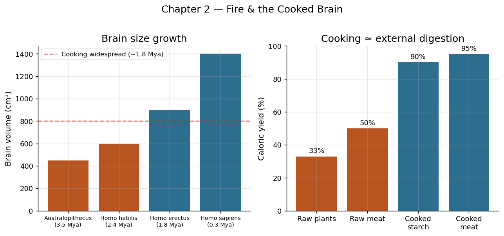

# Chapter 2: Fire — The First Energy Revolution

## Part I: The Age of Muscle

---

## The Night the Darkness Retreated

Picture a scene roughly 400,000 years ago, in a limestone cave on the slopes of Mount Carmel in what is now Israel. A band of early humans — Homo heidelbergensis or perhaps early Homo sapiens — huddles around a hearth. The fire is not an accident. It sits in a shallow pit, ringed by stones, fed deliberately with dried brushwood and animal dung. The flames throw shifting orange light across the cave walls. Outside, the Levantine night is alive with predators. Inside, there is warmth, light, and something cooking.

On flat stones beside the hearth, chunks of venison sizzle and brown. Nearby, tubers pulled from the hillside are buried in hot ash, their tough cellulose softening into something digestible. The smell of roasting meat draws the group closer. After hours of foraging and hunting in the unforgiving landscape, they eat — and they eat well. More calories from less effort. More nutrition from less food. More hours of wakefulness in the extended firelit evening.

This is not the first controlled use of fire by hominins. Evidence from Wonderwerk Cave in South Africa and from Gesher Benot Ya'aqov in Israel suggests that fire was being used — at least opportunistically — as early as a million years ago. But by 400,000 years before the present, fire had become a fixture of hominin life: maintained, transported, and applied with deliberate purpose. It was the first technology that tapped an energy source fundamentally external to the human body.

And it changed everything.

---

## The Thermodynamics of Cooking

To understand why fire was revolutionary, we need to talk about energy — specifically, the energy locked inside food.

Raw meat contains roughly 2,000 to 2,500 kilocalories per kilogram, depending on fat content. A raw tuber contains perhaps 400 to 800 kilocalories per kilogram. But these figures are misleading, because not all of those calories are biologically available. The human digestive system — the stomach, the small intestine, the liver — must do work to extract usable energy from food. Tough connective tissue in raw meat resists enzymatic breakdown. Starch granules in raw plants are locked within rigid cell walls. A significant fraction of the theoretical caloric content passes through the body undigested.

Cooking changes the equation dramatically. Heat denatures proteins, unraveling their complex three-dimensional structures and making them far more accessible to digestive enzymes. Heat gelatinizes starch, rupturing the crystalline structure of starch granules and converting them from resistant lumps into easily digestible gel. Heat softens cellulose, breaking down the cell walls that lock nutrients inside plant tissues.

The result, as biological anthropologist Richard Wrangham has argued persuasively, is that cooked food yields substantially more net energy than the same food eaten raw. Estimates vary, but cooking may increase the caloric yield of meat by 20 to 50 percent and of starchy tubers by as much as 100 percent. The exact numbers are debated; the direction is not. Cooking is, in Wrangham's memorable phrase, "external digestion" — outsourcing part of the digestive process to a fire, which can supply far more thermal energy than the human gut can generate metabolically.

---

## The Brain-Size Feedback Loop

Here is where the story becomes extraordinary. The human brain is metabolically expensive. Although it constitutes only about 2 percent of body mass, it consumes roughly 20 percent of the body's resting energy budget — about 15 watts of the total 75-watt metabolic budget at rest. This is an enormous overhead. No other organ in the body demands so much fuel for its size.

Large brains therefore pose an evolutionary puzzle. How can natural selection favor an organ so costly to maintain? The answer, Wrangham and others have proposed, lies in cooking. Here is the feedback loop:

1. Cooking increases the net caloric yield of food.
2. Higher caloric availability relaxes the energetic constraint on brain size.
3. Larger brains enable more sophisticated tool use, social coordination, and planning.
4. More sophisticated cognition enables better fire management and cooking techniques.
5. Return to step 1.

This is a positive feedback loop — a virtuous cycle in which each element reinforces the others. And the fossil record is broadly consistent with it. Brain size in the hominin lineage increased most dramatically between roughly 1.8 million and 300,000 years ago — precisely the period during which evidence for controlled fire use accumulates. Homo erectus, the first hominin with a brain substantially larger than an ape's, is also the first for which we have plausible evidence of habitual fire use.

Correlation is not causation, and the relationship between fire and brain size is certainly more complex than a simple two-variable model can capture. But the basic logic is compelling: cooking made large brains affordable, and large brains made better cooking possible. Fire did not merely feed the body; it fed the organ that would eventually learn to build nuclear reactors.

---

## Beyond the Kitchen: Fire as Chemical Processor

Cooking was fire's first gift to human productivity, but it was far from the last. Once early humans understood that heat could transform materials — could change their chemical composition, their physical properties, their very nature — they began applying that understanding in domains far beyond the kitchen.

**Hardening wood.** A fire-hardened spear point, its tip thrust into hot coals and then cooled, is harder and more durable than a simply sharpened stick. This technique appears to be ancient — the Schoningen spears from Germany, dating to roughly 300,000 years ago, show evidence of fire hardening at their tips.

**Processing adhesives.** Birch bark tar, used as a hafting adhesive to attach stone points to wooden shafts, requires heating birch bark to temperatures between 300 and 400 degrees Celsius in a low-oxygen environment. This is pyrotechnology — deliberate chemical transformation through controlled heat application. Evidence for birch tar production dates back at least 200,000 years in Europe.

**Heat-treating stone.** Some types of flint and chert become easier to knap after being heated to temperatures of 250 to 400 degrees Celsius and slowly cooled. The heat alters the microstructure of the silica, making it more homogeneous and predictable under the knapper's hammer. This technique was widely used by later Stone Age peoples and represents a remarkable insight: that you could improve a raw material before working it, adding a preparatory step to the manufacturing process.

**Firing clay.** The earliest known ceramic objects — the figurines from Dolni Vestonice in the Czech Republic, dating to about 29,000 years ago — were made by shaping wet clay and then hardening it in a fire. Full-scale pottery would not emerge for another 15,000 years, but the principle was established early: fire could transform soft, shapeless earth into hard, permanent vessels.

Each of these applications represents the same fundamental insight: fire is a programmable chemical reactor. By controlling temperature, duration, atmosphere (oxidizing versus reducing), and the material being heated, early humans could produce transformations that no amount of mechanical work could achieve. You cannot knead clay into ceramic. You cannot hammer wood into hardness. You cannot crush stone into improved flakeability. These transformations require energy — thermal energy — applied at levels far beyond what human muscles can generate.

---

## Quantifying the Fire Dividend

Let us return to our productivity framework. A cooking fire, even a modest campfire, produces approximately 5,000 to 10,000 watts of thermal output. A well-built kiln can reach 50,000 watts or more. Compare this to the 75 watts of sustained mechanical output available from a human body.

Of course, not all of that thermal energy is usefully directed. Much of a campfire's heat radiates into the sky or is carried away by convection. The efficiency of a simple cooking fire — useful heat transferred to food divided by total heat produced — may be as low as 10 to 15 percent. Even so, the effective thermal power applied to cooking tasks dwarfs anything the human metabolism could achieve internally.

But the productivity gain from fire is not best measured in watts. It is better measured in time. Consider the daily "time budget" of a great ape versus a human. Chimpanzees spend roughly 5 to 6 hours per day chewing. Their raw, fibrous diet demands extensive mechanical processing by the jaws and teeth. Humans, eating cooked food, spend less than one hour per day chewing. Those freed hours — 4 to 5 extra hours daily — become available for toolmaking, social bonding, teaching, planning, and all the other activities that constitute productive work.

Fire also extended the productive day itself. Before fire, useful activity was confined to daylight hours. Predator pressure and simple inability to see made nighttime a period of enforced inactivity. Firelight extended the day by several hours, creating time for work, storytelling, and the social interactions that build group cohesion.

If we crudely estimate that fire freed 5 hours from chewing and added 3 hours of evening activity, we have gained 8 productive hours per day — very nearly doubling the time available for non-subsistence activities. This is a productivity revolution of the first order, and it was accomplished not by making people work faster, but by giving them more time in which to work.

---

## From Campfire to Kiln: The Logic of Thermal Control

The history of fire technology is a history of increasing control. Each advance in fire management opened new productive possibilities.

**The open campfire** (~1,000,000 years ago): Uncontained combustion on the ground surface. Temperatures of 400 to 700 degrees Celsius in the flame zone. Adequate for cooking, warmth, and predator deterrence. No ability to regulate temperature or atmosphere.

**The hearth** (~400,000 years ago): A designated location, often a shallow pit lined with stones. The stones retained heat, allowed better air circulation, and created a more predictable thermal environment. Cooking became more consistent; the stones themselves could be heated and used as indirect cooking surfaces.

**The earth oven** (~30,000+ years ago): A pit filled with heated stones, food placed inside, covered with earth or leaves. This created a sealed, moderate-temperature environment (150 to 250 degrees Celsius) ideal for slow-cooking tough plant foods. The principle of indirect heating and atmospheric control was established.

**The kiln** (~26,000 years ago for ceramics; ~8,000 years ago for structural pottery): An enclosed chamber that traps heat and allows temperatures to be pushed to 600 to 1,100 degrees Celsius. The kiln represents the first true "thermal machine" — a structure designed specifically to contain and direct heat for a manufacturing purpose.

**The smelting furnace** (~5,000 years ago): Temperatures pushed to 1,100+ degrees Celsius with the aid of bellows, enabling the extraction of metals from ore. This is the technology that ends the Stone Age and begins the Age of Metals, but its roots lie in the kiln, and the kiln's roots lie in the campfire.

The trajectory is clear: from uncontrolled to controlled, from low temperature to high, from open atmosphere to managed environment. Each step represented a deeper understanding of what fire actually is — rapid oxidation releasing thermal energy — and how its parameters could be manipulated to achieve specific material transformations. This is the essence of engineering: understanding a natural process well enough to redirect it toward human purposes.

---

## Fire and the Social Order

Fire also reshaped human social life in ways that enhanced collective productivity. The hearth became a focal point — literally and figuratively — around which group life organized itself.

Anthropological studies of modern hunter-gatherer societies provide suggestive parallels. Among the Ju/'hoansi of the Kalahari, evening fireside conversation serves as a forum for conflict resolution, knowledge sharing, and collective planning. Stories told around the fire transmit ecological knowledge — where water can be found in drought, when certain plants fruit, how to track particular animals. The firelit evening is, in effect, a classroom and a boardroom simultaneously.

Fire also created the possibility of food preservation. Smoking meat and fish — exposing them to the antimicrobial compounds in wood smoke while gently drying them — could extend the usable life of perishable foods from days to weeks or months. This was a form of temporal arbitrage: converting a surplus available now into a reserve available later, smoothing out the boom-and-bust cycle of hunting and gathering. Societies that could store food could afford to stay in one place longer, could support individuals who specialized in non-food-producing activities, and could survive seasonal scarcities that would destroy less technologically sophisticated groups.

---

## The First Pollution, the First Tradeoff

It would be dishonest to tell the story of fire without acknowledging its costs. Indoor fire — in caves, in early shelters — produced smoke that damaged lungs and eyes. Soot deposits in ancient caves and the study of fossil hominin remains suggest that respiratory disease was a significant burden even in the Paleolithic. The warmth and cooking benefits of fire came at the price of chronic smoke inhalation.

This is worth noting because it establishes a pattern that recurs throughout the history of productivity: every energy source has externalities. Fire polluted the air. Draft animals polluted the fields. Coal polluted the cities. Petroleum pollutes the atmosphere. The challenge of each era is not merely to harness a new energy source, but to manage its unintended consequences. That challenge began with the first campfire.

---

## Fire as Template

Fire established a template that every subsequent energy technology would follow. The pattern has three elements:

1. **Capture**: Identify a source of energy external to the human body.
2. **Control**: Develop techniques to regulate the rate and direction of energy release.
3. **Apply**: Direct the controlled energy toward productive work that human muscles alone could not accomplish.

Capture, control, apply. This three-step logic describes the campfire (capturing the chemical energy of wood, controlling it in a hearth, applying it to cooking). It also describes the steam engine (capturing the chemical energy of coal, controlling it in a boiler, applying it through pistons to mechanical work). It describes the nuclear reactor (capturing the binding energy of uranium, controlling it with moderator rods, applying it through turbines to electricity generation). The scale changes; the logic does not.

Fire was the first time humans performed all three steps deliberately and systematically. It was the prototype for every energy revolution that followed.

---

## The Harnessing Theme

What was harnessed in this chapter? Energy itself — specifically, the chemical energy stored in biomass, released through combustion and directed toward purposes no amount of human muscle could achieve. Fire was the first technology that broke the 75-watt barrier, the first that drew power from outside the body and bent it to human will.

But fire also harnessed something subtler: time. By reducing the hours required for chewing, by extending the productive day into the evening, by enabling food preservation that decoupled consumption from immediate production, fire gave humans the most precious resource of all — hours in which to think, to plan, to teach, and to create.

The hand gave us tools. Fire gave us energy and time. Together, they made us human.

---

**Harnessing Moment:** In this chapter, humanity harnessed chemical energy — taming combustion as an external digestive system, a material transformer, and a time-liberator that doubled the productive day and fueled the expensive brain that would dream up every technology to come.
