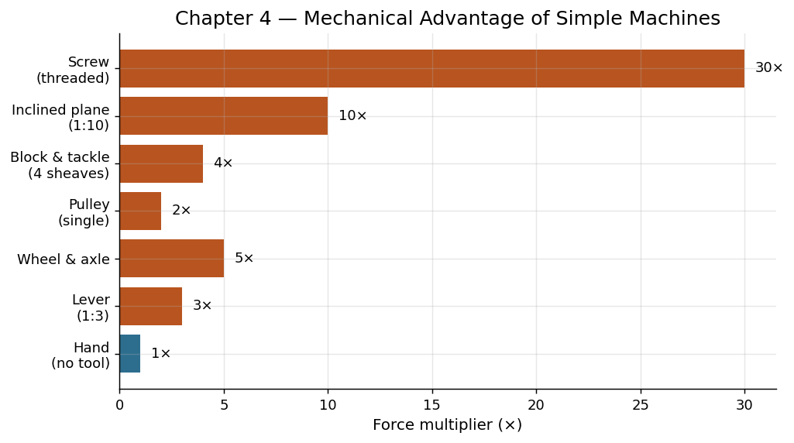

# Chapter 4: Levers and Wheels — Force Multipliers

## Part I: The Age of Muscle

---

## The Stone That Would Not Move

Around 2,560 BCE, on the Giza Plateau west of the Nile, a foreman faced a problem that would have been familiar to builders for thousands of years but had never been confronted at such a scale. A limestone block weighing approximately 2.5 metric tons — the average mass of the stones in the Great Pyramid of Khufu — needed to be raised from ground level to a height of 60 meters and placed with centimeter precision against its neighbor. The block was too heavy for any number of men to lift directly. And there were 2.3 million such blocks to be placed.

The foreman did not need superhuman strength. He did not need magic or alien technology (despite what a depressingly large segment of popular media would have you believe). What he needed was simple physics — the kind that had been understood intuitively by builders since the Neolithic, even if it would not be formalized mathematically for another two thousand years until Archimedes set stylus to papyrus.

He needed levers. He needed ramps. He needed rollers. He needed the wheel. He needed the basic principle that unites all of these devices: you cannot get something for nothing — energy is conserved — but you can trade force for distance. You can push gently over a long path to achieve the same effect as pushing hard over a short one. You can redirect force from a direction that is easy to one that is difficult. You can, in short, reshape the terms of the problem without changing its fundamental energetics.

This chapter is about that principle and its consequences — about the simple machines that allowed human and animal muscle, still limited to the same 75 to 750 watts as before, to accomplish feats that seem to defy those limits.

---

## The Physics of Simple Machines

Before we proceed to history, a brief excursion into physics. The concept underlying every simple machine can be stated in one sentence: work equals force multiplied by distance. If you need to do 1,000 joules of work (say, lifting a 100-kilogram stone one meter against gravity), you can apply 1,000 newtons of force over 1 meter, or 100 newtons of force over 10 meters, or 10 newtons of force over 100 meters. The total work is the same in each case. What changes is the tradeoff between how hard you push and how far you push.

This is not cheating. It is not perpetual motion. It is geometry — the rearrangement of mechanical advantage to match the available force (limited human or animal muscle) to the required task (moving something very heavy or very resistant).

The classical "simple machines" are six in number:

1. **The lever**: A rigid bar rotating around a fixed point (fulcrum). Move the fulcrum closer to the load and further from where you push, and you gain mechanical advantage — less force over a greater distance.

2. **The inclined plane (ramp)**: Moving a load up a gentle slope requires less force than lifting it vertically, at the cost of moving it over a longer path.

3. **The wedge**: An inclined plane in motion — a thin edge driven into a material converts a moderate force into enormous splitting pressure concentrated on a tiny area.

4. **The screw**: An inclined plane wrapped around a cylinder. One full rotation advances the screw by one pitch, converting rotary motion into linear force with high mechanical advantage.

5. **The wheel and axle**: A large wheel fixed to a smaller axle. Force applied at the rim of the wheel is multiplied at the axle (or, conversely, a small motion at the axle produces large motion at the rim). This also drastically reduces friction when used for transport.

6. **The pulley**: A wheel with a groove for a rope. A single fixed pulley changes the direction of force (pull down to lift up). Multiple pulleys in combination — a "block and tackle" — multiply force.

Every complex machine ever built, from the Antikythera mechanism to the Space Shuttle, is composed of combinations of these six elements. They are the alphabet of mechanical engineering.

---

## The Lever: Oldest and Most Ubiquitous

Archimedes reportedly said: "Give me a place to stand, and I shall move the Earth." He was talking about the lever — and he was not exaggerating the principle, only the application.

The lever is almost certainly the oldest simple machine deliberately employed by humans. Any stick used to pry up a rock is a lever. The digging stick — used by hunter-gatherers worldwide to extract tubers — is a lever. The atlatl (spear-thrower), which appeared at least 30,000 years ago, is a lever that extends the effective length of the throwing arm, dramatically increasing the velocity and range of a projectile.

But the lever reached its full productive potential in the context of construction. The shaduf — a counterweighted lever used for lifting water from rivers into irrigation channels — appeared in Mesopotamia by approximately 2,000 BCE and spread rapidly throughout the ancient world. A shaduf consists of a long beam balanced on an upright post, with a bucket on one end and a counterweight (typically a lump of dried mud) on the other. The counterweight nearly balances the weight of the full bucket, so the operator needs to apply only a small force to raise several liters of water through a height of 2 to 3 meters.

A single operator working a shaduf can raise approximately 2,500 liters of water per hour — enough to irrigate a small garden plot. Without the shaduf, the same operator scooping water by hand might manage 500 liters per hour. The fivefold improvement is directly attributable to the mechanical advantage of the lever and the energy recovery provided by the counterweight.

---

## The Wheel: Revolution in the Literal Sense

The wheel is so familiar, so seemingly obvious, that we rarely pause to consider what a profound invention it represents. And yet fully half the world's civilizations never independently developed it. The pre-Columbian Americas — home to sophisticated civilizations that built pyramids, developed writing systems, and managed empires spanning thousands of kilometers — never employed the wheel for transport (though they knew the principle, as wheeled toys from Mesoamerica demonstrate). The absence of suitable draft animals may partly explain this, but it also suggests that the wheel is less obvious than hindsight makes it appear.

The earliest known wheels date to approximately 3,500 BCE, appearing almost simultaneously in Mesopotamia, the Pontic-Caspian steppe, and Central Europe. These were solid wooden discs — not spoked wheels, which would come later — attached to axles that rotated within holes in a cart frame. The engineering challenges were considerable. The axle had to be precisely cylindrical. The hole had to be precisely round. The fit had to be tight enough to bear load but loose enough to rotate freely. Lubrication (animal fat, typically) was needed to reduce friction.

Why does the wheel matter so much? Because it attacks the fundamental enemy of land transport: friction. Dragging a 1,000-kilogram load across flat ground on a sled requires overcoming a frictional force of roughly 500 to 700 newtons (depending on surface conditions). Place that same load on a wheeled cart, and the required force drops to 30 to 50 newtons — a reduction of more than 90 percent. The wheel does not reduce the total energy required to move the load (that is fixed by the distance and any changes in elevation), but it does so by almost eliminating the energy wasted as friction-generated heat.

In practical terms, this means that one ox pulling a wheeled cart can move a load that would require ten oxen dragging a sled. The wheel multiplied the effective capacity of every draft animal in a civilization's inventory, compounding the productivity gains described in the previous chapter.

---

## The Inclined Plane: Building Toward the Sky

The ramp — the simplest of inclined planes — is the technology that made monumental architecture possible. To raise a 2.5-ton limestone block to a height of 60 meters requires performing approximately 1.5 million joules of work against gravity. If you want to accomplish this using teams of men pulling on ropes (the most probable method for pyramid construction), you need to reduce the required pulling force to something a human team can sustain.

A ramp with a slope of 1:10 (rising one meter for every ten meters of horizontal distance) reduces the required pulling force by a factor of ten, at the cost of multiplying the distance by ten. The block must travel 600 meters along the ramp rather than 60 meters vertically, but at each point along the path, the force required is within the capacity of a team of 20 to 30 men.

The logistics of pyramid ramp construction are themselves staggering. A straight ramp reaching the summit of the Great Pyramid at a 1:10 grade would need to be 1.5 kilometers long and would contain more material than the pyramid itself. Various solutions have been proposed: spiral ramps wrapping around the pyramid's exterior, internal ramps within the structure, combinations of ramps and levers. The debate continues among Egyptologists and engineers. What is not debated is the principle: inclined planes were the essential technology that translated limited human pulling force into the vertical displacement required to stack 2.3 million stone blocks into the largest structure on Earth.

---

## The Pulley and the Block-and-Tackle

The pulley appears in the archaeological record by roughly 1,500 BCE, though simpler rope-and-beam arrangements that served similar functions are certainly much older. The genius of the pulley system — particularly the compound pulley or "block and tackle" — is that it can multiply force to almost any desired degree, limited only by the friction losses in the system and the available length of rope.

A simple block and tackle with four rope segments supporting the load provides a 4:1 mechanical advantage: pull with 250 newtons, lift 1,000 newtons. The tradeoff is distance — you must pull 4 meters of rope for every 1 meter the load rises. But for tasks like raising stone blocks to the tops of temple walls, sail yards to the tops of masts, or buckets from deep wells, this tradeoff is enormously favorable.

The Romans were masters of pulley engineering. The Roman treadwheel crane — a large wooden wheel inside which one or two men walked (hamster-wheel fashion) to wind a rope — combined the wheel-and-axle principle with a multi-sheave pulley to create a lifting machine capable of raising loads of 3,000 to 6,000 kilograms. A single Roman crane operated by two men could do the work that would otherwise require fifty men pulling directly on ropes. This is a 25:1 productivity multiplier achieved through pure mechanical advantage, with no new energy source.

---

## Water Systems: The First Infrastructure

Simple machines reached their greatest impact not in isolation but in systems — coordinated networks of devices and structures designed to accomplish goals that no single machine could achieve alone. The earliest and most important of these systems were hydraulic: irrigation networks that controlled the flow of water across entire river basins.

The irrigation systems of ancient Mesopotamia, Egypt, and the Indus Valley represent perhaps the first true "systems engineering" in human history. Consider the canal network of Sumer, operational by 4,000 BCE. It consisted of:

- **Primary canals** drawing water from the Euphrates, requiring excavation of channels several meters deep and many kilometers long.
- **Secondary distribution channels** branching from the primaries to serve individual field systems.
- **Control structures** — weirs, sluices, and gates — to regulate flow rates and water levels.
- **Drainage channels** to remove excess water and prevent waterlogging and salinization.
- **Maintenance protocols** requiring annual clearing of silt, repair of banks, and adjustment of flow patterns.

No single simple machine made this system possible. It was the combination of many: levers and shaduffs for lifting water, inclined planes for controlling gradients, wedges for splitting earth, wheels for transporting materials. And it was the organizational achievement — the coordination of thousands of workers over decades — that transformed these individual machines into a functioning whole.

The productivity payoff was enormous. Irrigated land in Mesopotamia could produce 2,000 to 3,000 kilograms of barley per hectare — two to three times the yield of rain-fed agriculture. An irrigation system serving 10,000 hectares could support a city of 50,000 people. Without irrigation, the same landscape supported scattered pastoral communities numbering in the hundreds.

---

## The Canal: Horizontal Infrastructure

If irrigation was about controlling water vertically — lifting it, directing it, managing its level — canals were about controlling it horizontally, as a medium of transport. A boat on still water experiences almost no friction. A canal barge carrying 50 tons of grain requires less pulling force than a single ox cart carrying one ton on a road. Water transport is, and has always been, the cheapest way to move bulk goods.

The ancient Egyptians connected the Nile to the Red Sea via a canal (precursor to the modern Suez) as early as the reign of Senusret III (circa 1,850 BCE), though the precise date and even the existence of this early canal are debated. What is certain is that by the New Kingdom (circa 1,500 BCE), Egypt had an extensive network of navigable canals linking agricultural areas to urban centers and to ports for international trade.

China's Grand Canal, begun in the 5th century BCE and extended over subsequent centuries to reach its full length of nearly 1,800 kilometers by the Sui Dynasty (7th century CE), was the largest infrastructure project of the pre-modern world. It connected the rice-producing south to the administrative capital in the north, enabling the transfer of millions of tons of grain annually over distances that would have been prohibitively expensive by land transport.

These canal systems exemplify a key principle: sometimes the greatest productivity gain comes not from working faster but from reducing the energy cost of moving things. The simple machines of the inclined plane and the lever were embedded in canal lock systems (beginning perhaps as early as the 3rd century BCE in China) that allowed barges to "climb" over terrain — ascending hill country by steps, each lock lifting the barge a few meters, trading time for the impossible task of dragging loaded boats overhill.

---

## Pyramids: Peak Achievement of Organized Muscle

The Great Pyramid of Khufu stands as the supreme testament to what organized human and animal muscle, directed by simple machines, could accomplish. Let us quantify the achievement.

The pyramid contains approximately 2.3 million stone blocks averaging 2.5 tons each, for a total mass of roughly 5.75 million metric tons. It was constructed over approximately 20 years (the reign of Khufu, circa 2,560 to 2,540 BCE). This requires placing an average of 315 blocks per day, or roughly one block every 4.5 minutes during daylight working hours.

The total mechanical work represented by the pyramid — lifting all that stone from quarry level to its final resting place — is approximately 2.4 trillion joules. Spread over 20 years of construction at roughly 300 working days per year, this averages to about 400 billion joules per year, or roughly 12,700 watts of continuous mechanical output dedicated to lifting alone (not including quarrying, transport, or finishing).

At 75 watts per worker, this implies a minimum of about 170 workers dedicated exclusively to lifting at all times — surprisingly modest. Actual workforce estimates, accounting for all tasks (quarrying, transport, ramp building, finishing, supply), range from 20,000 to 30,000 workers. The key point is that the pyramid was not built by slaves in Hollywood-biblical-epic numbers (hundreds of thousands). It was built by a well-organized workforce of perhaps 25,000, supported by simple machines that multiplied their individual output.

Ramps provided the mechanical advantage for raising blocks. Levers positioned them with precision. Copper chisels and wooden wedges (expanded with water to split stone along natural fracture lines) quarried them. Wooden rollers and sledges transported them. The organizational system — logistics, scheduling, worker rotation, food supply — was itself a kind of machine, coordinating individual efforts into collective output far beyond what any unorganized group could achieve.

---

## The Great Wall: Linear Infrastructure at Scale

If the pyramids represent the vertical extreme of muscle-age construction, the Great Wall of China represents the horizontal extreme. The various walls built across northern China between the 7th century BCE and the 17th century CE total roughly 21,000 kilometers in aggregate length. The most famous sections — the Ming Dynasty walls built in the 15th and 16th centuries CE — stretch approximately 8,850 kilometers and contain an estimated 3.8 billion individual bricks.

The Wall was not a single construction project but a cumulative effort spanning two millennia. Nonetheless, individual campaigns were enormous. The Qin Dynasty construction (circa 221 to 206 BCE) reportedly employed 300,000 to 500,000 workers — soldiers, conscripts, and convicts — over approximately 12 years. The logistics of feeding, supplying, and organizing such a workforce across thousands of kilometers of often-inhospitable terrain represent a systems-engineering challenge comparable to (or exceeding) the pyramids.

The Wall employed every simple machine in the ancient engineer's toolkit. Ramps for raising materials to wall-top level. Levers for positioning heavy stones. Wheels for transporting bricks and mortar. Pulleys for lifting supplies to elevated guard towers. And beneath all of these, the inclined plane in its grandest form: the Wall itself follows the ridgelines of northern China's mountains, exploiting natural elevation for defensive advantage while accommodating gradients that supply carts could still negotiate.

---

## Work Conservation and the Limits of Muscle

All the simple machines in this chapter share a fundamental limitation: they cannot create energy. They can only redirect it, redistribute it, reshape its application. A lever does not add watts to the system. A wheel does not add watts. They allow the available watts — 75 from a human, 750 from an ox — to be applied more effectively, but the total energy budget remains the same.

This means that the Age of Muscle had a ceiling. No matter how cleverly you arrange levers and pulleys, no matter how elegantly you design your ramps and wheels, you cannot escape the biological limits of the bodies that power the system. A civilization running on muscle — human and animal — can achieve extraordinary things (pyramids, great walls, canal networks spanning continents), but only by concentrating enormous numbers of bodies on single tasks. And those bodies all need to be fed, housed, and organized, which itself consumes a large fraction of the society's productive output.

The pyramids required 25,000 workers for 20 years. The Grand Canal required millions of labor-hours across centuries. The Great Wall consumed generations. These are achievements purchased with time — vast quantities of human time, applied with admirable cleverness but bumping always against the same constraint: the metabolic power density of biological muscle is low.

Breaking through that ceiling would require tapping energy sources denser and more abundant than food calories converted to muscle contraction. It would require harnessing flowing water, blowing wind, and eventually the concentrated ancient sunlight locked in fossil fuels. That story begins in Part II.

But before we leave the Age of Muscle, let us appreciate what simple machines accomplished within its constraints. They did not add energy to the system. They did something almost as valuable: they made the available energy usable. A 2.5-ton stone block contains, in potential, the possibility of being at the top of a pyramid. What simple machines provided was the pathway — the geometric arrangement of force and distance that turned possibility into actuality, one patient meter at a time.

---

## The Systems Insight

The greatest lesson of this chapter is not about any individual machine. It is about combination and system. A lever alone is a useful tool. A lever combined with a ramp, a roller, a pulley, a coordinated workforce, a supply chain, and an administrative system is a civilization-building technology.

This is the insight that separates engineering from mere toolmaking. The engineer does not just solve a local problem (how to move this rock). The engineer designs a system that solves a class of problems reliably and repeatedly (how to move millions of rocks to precise locations over decades). The difference is organizational as much as technical. The simple machines provide the physical substrate; the organizational system provides the logic that coordinates their application.

In this sense, the pyramid builders and canal diggers of the ancient world were the first systems engineers — people who thought not just about forces and materials but about logistics, scheduling, supply chains, quality control, and workforce management. These are the same categories that a modern project manager uses. The tools have changed beyond recognition. The thinking has not.

---

**Harnessing Moment:** In this chapter, humanity harnessed geometry itself — using the mathematical relationships of force, distance, and direction embodied in simple machines to reshape limited muscle power into civilization-scale construction, irrigation, and transport systems that defined the upper boundary of what biological energy could achieve.
