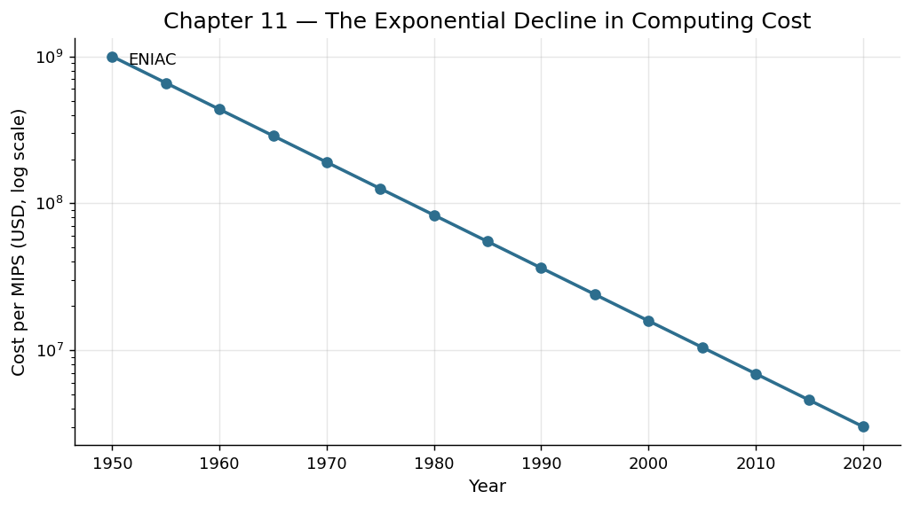

# Chapter 11: The Computer — Automating Logic

## Part IV: The Information Age

On the evening of February 14, 1946, the University of Pennsylvania held a press conference unlike any other. Journalists were ushered into a large room where thirty tons of electronic equipment hummed and flickered behind panels of blinking lights. The machine before them, ENIAC — the Electronic Numerical Integrator and Computer — had just completed a calculation in thirty seconds that would have taken a skilled human mathematician twenty hours. The reporters struggled for analogies. One called it a "giant brain." Another described it as "an awesome mathematical Frankenstein." What none of them could have predicted was that this room-sized apparatus, consuming enough electricity to power a small neighborhood, represented the embryonic form of a technology that would eventually fit in a shirt pocket and reshape every dimension of human productivity.

The story of the computer is, at its core, a story about the mechanization of thought itself. For millennia, humans had built tools to amplify physical labor — the lever, the wheel, the steam engine. But the computer represented something categorically different: a machine that could automate the process of reasoning. It could follow logical instructions, make decisions based on conditions, and repeat operations without fatigue or error. In the grand arc of human productivity, this was not merely another step forward. It was a leap into an entirely new dimension.

## From Counting Machines to Universal Computers

The intellectual ancestry of the computer stretches back centuries. Blaise Pascal built a mechanical calculator in 1642. Charles Babbage designed his Analytical Engine in the 1830s, a device that — had it been completed — would have been the world's first general-purpose computer. Ada Lovelace, writing notes on Babbage's machine, articulated the revolutionary insight that such a device could manipulate symbols of any kind, not just numbers. She was, in effect, describing software before hardware existed to run it.

But the theoretical breakthrough that made modern computing possible came from Alan Turing in 1936. His concept of a "universal machine" — a device that could simulate any other machine given the right instructions — established that a single piece of hardware could perform any computable task. The implications were staggering. You did not need a separate machine for each problem. You needed one machine and many sets of instructions.

ENIAC, though groundbreaking, was still a transitional creature. Programming it required physically rewiring its circuits — a process that could take days. The stored-program concept, developed by John von Neumann and others, changed everything. By placing instructions in the same memory as data, the computer became truly flexible. Programs could be swapped in seconds rather than days. The machine became general-purpose in practice, not just in theory.

## The Exponential Decline in Computing Costs

What happened next defies easy comprehension. The cost of computation began falling at a rate unprecedented in the history of any technology. In 1952, a computer capable of performing a thousand calculations per second cost roughly $1 million (about $11 million in today's dollars). By 1970, equivalent computing power cost perhaps $100,000. By 1990, it cost $1,000. By 2010, it cost pennies.

This exponential decline was driven by the relentless miniaturization of transistors — the tiny electronic switches that form the basis of all digital logic. In 1965, Gordon Moore, co-founder of Intel, observed that the number of transistors on an integrated circuit doubled approximately every two years while costs remained constant. This observation, known as Moore's Law, proved remarkably durable for over five decades. Each doubling meant more power in less space at lower cost.

The numbers are almost absurd in their scale. The ENIAC contained about 18,000 vacuum tubes and occupied 1,800 square feet. A modern smartphone contains billions of transistors on a chip smaller than a fingernail and delivers computational power roughly ten million times greater. If automobile technology had improved at the same rate as semiconductor technology since 1970, a car today would travel at the speed of light and cost less than a cent.

This cost collapse did something profound: it democratized computation. What began as a tool exclusively for governments and large corporations became accessible to small businesses, then to families, then to individuals. Each wave of democratization unleashed new forms of productivity.

## Software: Encoding Thought as a Repeatable Tool

Hardware was only half the revolution. The other half — arguably the more important half — was software. For the first time in history, humans could encode a thought process, a method of analysis, a decision-making procedure, and make it perfectly repeatable and infinitely distributable.

Consider what this meant. Before software, expertise lived exclusively in human minds. If a brilliant accountant developed an elegant method for analyzing financial statements, that method could only be applied as fast as the accountant could work, and it vanished when the accountant retired. Software changed this equation entirely. A method, once encoded as a program, could be executed millions of times simultaneously, never forgot a step, never got tired, and could be distributed to anyone with a compatible machine.

The earliest business software automated clerical drudgery — payroll processing, inventory tracking, billing. These applications alone produced enormous productivity gains. A task that once required a room full of clerks working for days could be completed by a single computer in minutes. Banks that once employed hundreds of people to process checks could handle the same volume with a fraction of the staff.

But software's true power extended far beyond mere automation of existing tasks. It enabled entirely new forms of work that had been previously impossible. Computer-aided design allowed engineers to test thousands of variations of a structure without building physical models. Spreadsheet software — first VisiCalc in 1979, then Lotus 1-2-3, then Microsoft Excel — gave every manager the analytical power that had once required a team of financial analysts. Word processors didn't just replace typewriters; they transformed the act of writing itself, making revision effortless and collaboration possible across distances.

The emergence of databases deserves special mention. Before computers, information was stored in physical files — paper in folders in cabinets in rooms. Finding a specific piece of information meant knowing where it was filed or conducting a laborious manual search. Databases made all stored information instantly searchable, cross-referenceable, and analyzable. This alone represented a productivity revolution in any information-intensive enterprise.

## The Personal Computer Revolution

The arrival of the personal computer in the late 1970s and early 1980s marked a pivotal transition. The Apple II (1977), the IBM PC (1981), and the Macintosh (1984) brought computing power to desktops that had previously required dedicated rooms. But more importantly, they placed the power of software creation in the hands of millions.

Before personal computers, using a computer meant working through an intermediary — submitting jobs to a data processing department, waiting hours or days for results. The PC eliminated this bottleneck. A manager with a question about sales trends could sit down, open a spreadsheet, and have an answer in minutes. A designer with an idea could sketch it in a CAD program immediately. The feedback loop between question and answer, between idea and prototype, compressed from days to minutes.

This compression had cascading effects on organizational productivity. Decision-making accelerated. Experimentation became cheaper. The cost of being wrong — of trying an approach and discovering it didn't work — plummeted. And as any economist will tell you, when the cost of experimentation falls, the rate of innovation rises.

By the early 1990s, the personal computer had become standard equipment in offices throughout the developed world. An estimated 65 million PCs were in use in American workplaces by 1993. The transformation was so rapid and so complete that it became difficult to imagine how work had been done without them.

## The Productivity Paradox

Yet the story of computing and productivity is not a simple tale of triumph. In 1987, the economist Robert Solow made a famous observation: "You can see the computer age everywhere but in the productivity statistics." This became known as the productivity paradox — the puzzling gap between the obvious transformative power of computers and their apparent failure to show up in macroeconomic productivity measurements.

Several explanations have been offered for this paradox. First, there were substantial learning costs. Organizations that purchased computers often spent years figuring out how to use them effectively. The hardware sat on desks, but workflows remained unchanged. People used word processors as expensive typewriters, typing documents from scratch rather than exploiting the power of templates and revision.

Second, computers initially generated new kinds of unproductive work. The ease of producing documents led to an explosion of reports that nobody read. The ability to create elaborate presentations consumed hours that might have been spent on substantive work. Email, which promised to streamline communication, often became a source of endless distraction.

Third, and most fundamentally, the full productivity benefits of computing required complementary innovations in organizational structure, management practices, and business processes. The companies that gained the most from computers were not those that simply automated existing workflows. They were those that reimagined their entire operations around the capabilities that computing made possible.

By the late 1990s, the paradox began to resolve. Productivity growth in the United States accelerated sharply between 1995 and 2004, driven largely by information technology. The lag had been real, but so was the eventual payoff. Organizations had finally learned not just to use computers, but to reorganize themselves around computing's possibilities.

## The Computer as a Meta-Tool

What makes the computer unique in the history of human tools is its nature as a meta-tool — a tool for creating other tools. A lathe can shape metal, but it cannot reshape itself. A printing press can reproduce text, but it cannot redesign its own mechanism. A computer, through software, can become any tool its user can imagine and describe precisely enough to program.

This meta-tool quality means that the computer's productivity impact is not fixed but compounding. Each generation of software tools enables the creation of more sophisticated software tools. Computer-aided design software was itself designed using computer-aided design software. The compilers that translate programming languages into machine code were themselves written in programming languages. This recursive self-improvement has no analog in the history of physical tools.

The result is a technology whose productivity impact continues to grow decades after its introduction — not asymptotically approaching some limit, but accelerating as each layer of capability enables the next. The computer did not merely automate the tasks of 1946. It created entirely new categories of work, new industries, new forms of human collaboration, and new ways of generating and applying knowledge.

## Harnessing Moment

The computer represents humanity's most audacious act of harnessing: the capture and domestication of logic itself. Every previous tool in this book — from fire to the steam engine to electricity — harnessed some form of physical energy or material process. The computer harnessed something immaterial: the structure of rational thought.

What Alan Turing recognized, and what ENIAC's builders demonstrated, was that reasoning could be decomposed into elementary operations simple enough for a machine to perform. Thought, or at least a crucial subset of thought — logical deduction, arithmetic, comparison, conditional branching — could be mechanized. And once mechanized, it could be scaled without limit.

This was harnessing in its purest form. Just as the steam engine captured the energy locked in coal and made it do useful work, the computer captured the patterns of human reasoning and made them execute tirelessly and at electronic speed. The "fuel" was information; the "engine" was the processor; the "output" was decisions, analyses, and transformations that had previously required human minds.

But unlike coal or oil, information is not consumed in its use. A program can run a billion times without degrading. This made the computer not just a powerful tool but an infinitely renewable one — a harnessing of thought that, once achieved, never needs to be achieved again. Each program written becomes a permanent addition to humanity's cognitive infrastructure, a piece of mental labor that never again needs to be performed by a human mind. In this sense, the computer did not just increase productivity. It changed the very nature of what productivity means.
