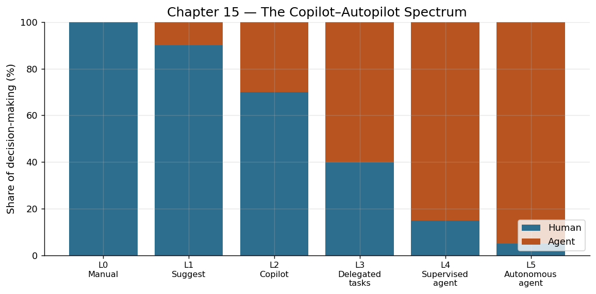

# Chapter 15: AI Agents — The Tool That Wields Tools

---

## The Night Shift That Never Clocks Out

In March 2024, a startup founder in Berlin went to bed at midnight with an idea sketched on a napkin: a web application that would help small restaurants manage food waste. When she woke at seven the next morning, she found the following waiting for her: a functional prototype deployed to a staging server, a database schema with twelve tables, an API with twenty-three endpoints, a frontend with responsive design, a test suite with 89% coverage, and a pull request with a clear summary explaining every architectural decision.

She had not hired a team overnight. She had not outsourced to a development shop in another time zone. Before going to bed, she had spent forty-five minutes in conversation with an AI agent, describing what she wanted in plain language, answering its clarifying questions, and approving its proposed architecture. Then she said: "Build it." And while she slept, the agent worked — reading documentation, writing code, running tests, debugging failures, and iterating until the result matched her specification.

This was not a parlor trick. The code was production-quality. The architecture reflected genuine understanding of restaurant operations. The agent had made dozens of implementation decisions autonomously — choosing appropriate libraries, designing the database normalization, handling edge cases — each one reasonable, each one the kind of decision that previously required a human engineer's judgment.

The tool that had built this was not merely a language model. It was something more: a language model connected to a set of tools, embedded in a loop that allowed it to perceive the state of the world, reason about what to do next, act through those tools, and learn from the feedback. It was an AI Agent — the tool that wields tools.

---

## Anatomy of an Agent: The Core Loop

An AI agent is not a single technology but an architecture — a way of arranging components so that a language model can take sustained, autonomous action in the world. At its heart is a loop so simple it can be stated in four words: perceive, reason, act, feedback.

**Perceive.** The agent receives information about the current state of its environment. This might be the contents of a file system, the output of a command, an error message, the response from an API, the text of an email, or the state of a database. Perception is the agent's sensory input — the raw material from which it must understand its situation.

**Reason.** Given its perception of the current state and its understanding of the goal, the agent uses the language model to decide what to do next. This is not simple pattern matching. The model maintains a representation of the overall task, tracks what has been accomplished and what remains, considers multiple possible actions, anticipates their consequences, and selects the most promising path forward. This reasoning step is where the power of large language models — their ability to understand context, draw analogies, apply general principles to specific situations — is most fully exploited.

**Act.** The agent executes its chosen action by invoking a tool. It might write a file, run a shell command, make an API call, send a message, query a database, or perform any other operation available through its tool chain. The action changes the state of the environment.

**Feedback.** The agent observes the result of its action. Did the code compile? Did the test pass? Did the API return the expected response? Did the file write successfully? This observation becomes the new perception, and the loop repeats.

This loop — perceive, reason, act, feedback — runs until the agent determines that its goal has been achieved, or until it encounters a situation that requires human input. A single task might require the loop to execute dozens or hundreds of times, with the agent progressively building toward its objective through a sequence of incremental actions.

The elegance of this architecture lies in its generality. The same loop structure can drive a coding agent, a research agent, a data analysis agent, a customer service agent, or a creative writing agent. What changes between these applications is not the loop itself but the tools available to the agent and the nature of the goals it pursues.

---

## The Harness: Connecting Mind to World

If the language model is the brain of an agent, the harness is its nervous system and musculature — the architecture that connects reasoning to action. The term is not accidental. In the physical world, a harness is the apparatus that connects a source of motive power (a horse, a team of oxen) to the work to be done (pulling a plow, drawing a carriage). It is the structure that transforms raw force into directed effort.

An AI agent's harness consists of several components:

**The tool registry.** A structured catalog of every tool the agent can use, including descriptions of what each tool does, what parameters it accepts, and what outputs it produces. The language model reads these descriptions to understand its capabilities — what it can do, and how.

**The execution environment.** The sandboxed runtime in which the agent's actions take effect. This might be a container with file system access, a set of API credentials, a browser session, or a combination of these. The execution environment determines the boundary between what the agent can affect and what it cannot.

**The context manager.** The system that maintains the agent's working memory — its understanding of what has happened so far, what the current state is, and what the goal requires. Because language models have finite context windows, the context manager must strategically compress, summarize, and prioritize information.

**The control layer.** The governance mechanism that determines what the agent is allowed to do without human approval and what requires escalation. This might enforce rules like "you may write files but not delete them," "you may make API calls to staging but not production," or "you must ask permission before spending more than $10."

Together, these components constitute the harness — the framework that transforms a language model from a passive text generator into an active agent capable of sustained, goal-directed work in the real world. The harness is what makes the difference between a chatbot (which talks about action) and an agent (which takes action).

---

## From Copilot to Autopilot: A Spectrum

The relationship between human and agent is not binary — it exists on a spectrum. Understanding this spectrum is essential to understanding how agents integrate into human workflows and why the transition is happening gradually rather than all at once.

**Level 0: Manual.** The human does all the work. The machine is a passive tool — a text editor, a calculator, a file system. This was the state of computing until approximately 2021.

**Level 1: Suggestion.** The machine offers suggestions that the human can accept or reject. Autocomplete in a code editor. Spell-check in a word processor. Each suggestion is atomic and low-risk. The human remains fully in control, and the machine merely reduces friction.

**Level 2: Copilot.** The machine takes on larger chunks of work but operates under direct human supervision. GitHub Copilot exemplifies this level: it generates entire functions, but the human reviews each one before accepting it. The machine produces; the human validates. The cognitive load shifts from generation to evaluation.

**Level 3: Supervised Autonomy.** The machine works independently on a defined subtask but checks in with the human at key decision points. An agent that can write and test a feature but asks for architectural guidance before proceeding. An agent that drafts a report but requests human approval before sending it. The human sets direction and approves milestones; the agent handles execution.

**Level 4: Autopilot.** The machine works independently on a defined goal with minimal human intervention. The human specifies the objective, reviews the final result, and may be consulted if the agent encounters an unexpected situation, but the bulk of the work — including many judgment calls — is handled autonomously.

**Level 5: Full Autonomy.** The machine identifies its own goals, plans its own work, and executes without human involvement. This level remains largely theoretical as of this writing, and its desirability is a matter of vigorous debate.

The current frontier of practical deployment sits at Levels 2-4, with most professional use concentrated at Levels 2-3. The progression from Copilot to Autopilot is not merely a technical transition — it is a social and organizational one. Each level requires a different kind of trust, a different set of safeguards, and a different model of human-machine collaboration.

---

## One Person, a Fleet of Agents

The most radical implication of AI agents is not that they can do what a single worker does, but that they can be multiplied. A language model is software. Software can be instantiated in parallel. One person can direct not one agent but many — each working on a different aspect of the same project, or on entirely separate projects, simultaneously.

Consider the startup founder from our opening story. She did not interact with one agent working sequentially. She described the high-level architecture once, and the system decomposed the work into parallel streams: one agent designed the database schema, another built the API layer, another constructed the frontend, another wrote tests. These agents coordinated with each other, resolving interface contracts and dependencies, occasionally escalating genuine ambiguities to the human for resolution.

This pattern — one human directing a fleet of agents — fundamentally alters the economics of production. A single product manager with taste, judgment, and domain expertise can direct a fleet of agents equivalent in output to an entire development team. A single researcher with deep questions can deploy agents to search literature, analyze datasets, generate hypotheses, and run simulations simultaneously across multiple lines of inquiry.

The historical parallel is the Industrial Revolution's multiplication of physical force. In 1750, a master craftsman's productivity was limited by his own two hands and the apprentices he could train and supervise. By 1850, a factory owner directing a fleet of machines could produce in a day what the craftsman's shop produced in a year. The machines did not replace the master's expertise — they amplified it. His knowledge of quality, design, and customer needs became more valuable, not less, because it could now be applied at scale.

AI agents stand in the same relation to knowledge workers. The programmer's understanding of software architecture, the lawyer's judgment about legal strategy, the scientist's intuition about promising research directions — these become more valuable when they can be applied not to one stream of work but to twenty simultaneously.

---

## Quantifying the Multiplication

Early measurements of agent-driven productivity gains suggest a transformation of unprecedented speed and magnitude.

In software development, controlled studies show that developers using agent-based coding tools complete complex projects 3-10x faster than those working alone, depending on the task complexity and the developer's skill in directing the agent. More significantly, the variance in productivity between developers narrows: the gap between the most and least productive developers shrinks because the agents compensate for gaps in specialized knowledge.

In content creation, agents can produce, revise, and format written content at a rate of approximately 10,000-50,000 words per hour — compared to a skilled writer's 500-2,000 words per hour. The human's role shifts from writing to directing, editing, and quality assurance.

In research and analysis, agents can process and synthesize volumes of information that would take human teams weeks or months. A legal discovery process that required a team of ten paralegals working for three months can be completed by one lawyer and a fleet of agents in days.

But the most striking quantification is not speed but scope. Before agents, the number of projects a single person could realistically manage was constrained by their bandwidth for execution. With agents, the constraint becomes judgment and direction — how many parallel streams of work can one person meaningfully oversee? Early evidence suggests the answer is somewhere between five and twenty, depending on the domain and the person's skill as a "harnesser" of agents.

---

## The New Craft: Directing Agents

If agents represent the force to be harnessed, then directing agents effectively is the new craft — the skill that separates those who fully exploit this technology from those who merely dabble with it.

Effective agent direction requires several abilities that are distinct from traditional technical skills:

**Problem decomposition.** The ability to break a large, ambiguous goal into well-defined subtasks that an agent can execute independently. This is similar to the skill of a good manager — not doing the work yourself, but structuring it so that others can do it well.

**Specification clarity.** The ability to express requirements precisely enough that an agent can act on them without constant clarification, while remaining at a level of abstraction that allows the agent to make appropriate implementation decisions.

**Quality evaluation.** The ability to assess an agent's output — to recognize when code is correct but architecturally poor, when a document is accurate but tonally wrong, when an analysis is technically sound but strategically irrelevant.

**Feedback calibration.** The ability to provide feedback that helps the agent improve its subsequent actions — neither so vague that the agent cannot act on it, nor so prescriptive that you might as well do the work yourself.

These skills are not entirely new. They are the skills of leadership, management, and creative direction — recontextualized for a new kind of worker. The best agent directors are often not the most technically skilled people but the ones with the clearest thinking, the best taste, and the most precise communication.

---

## The Historical Connection

Every revolution in productivity has created a new role for the human at the center of it. The farmer who once pushed the plow became the driver who directed the ox. The artisan who once shaped metal by hand became the machinist who directed the lathe. The clerk who once computed tables by hand became the programmer who directed the computer.

In each case, the human moved from being the source of the force to being the director of the force. The knowledge required changed — from knowing how to push to knowing how to direct, from knowing how to compute to knowing how to program. But the human remained essential: not as the muscle, but as the mind; not as the executor, but as the intender.

The AI agent represents the latest iteration of this ancient pattern. The knowledge worker who once wrote code, drafted documents, and analyzed data directly now directs agents that perform these tasks. The human's role shifts from execution to intention, from production to judgment, from doing to directing.

And the architecture that makes this possible — the harness that connects the model's intelligence to the world's tools — is, both literally and metaphorically, a set of reins: the means by which human intention controls and directs a new kind of force.

---

## Harnessing Moment

The AI agent is where the double meaning of "harness" collapses into a single reality. The verb and the noun become one. To harness a language model — to bring it under control and direct its force toward productive ends — requires a harness: the literal software architecture that connects model to tools, reasoning to action, intelligence to world.

This is not a coincidence of language. It is a convergence of concept. Every force humanity has ever harnessed required a physical apparatus to channel it: the yoke for the ox, the waterwheel for the river, the boiler for steam, the wire for electricity, the instruction set for the processor. The agent harness is the latest in this lineage — the apparatus that channels the force of machine intelligence into productive work.

The tool that wields tools. The mind that directs other minds. The harness that completes the metaphor.
