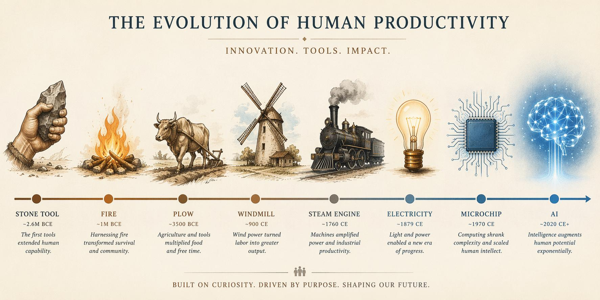
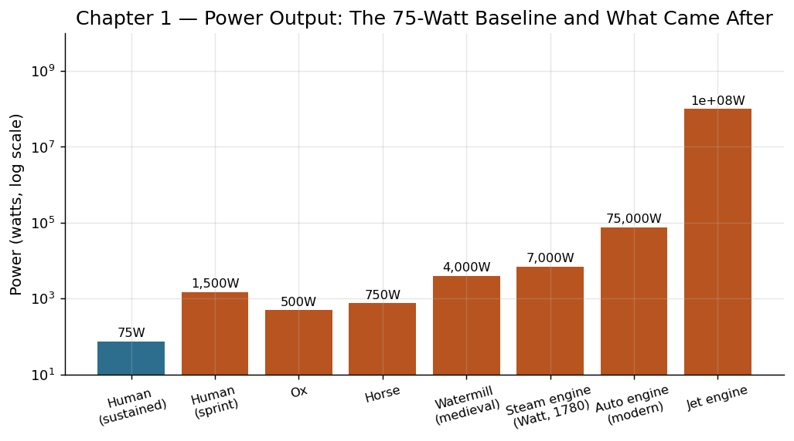

# 第一章 手：第一件工具

## 一块石头改变了一切

大约260万年前[^1]，东非大裂谷的某处河滩上，一个身高不到一米五的古人类——后来被我们称为"能人"（Homo habilis）——蹲在地上，用一块鹅卵石猛击另一块石头的边缘。碎片飞溅，留下一个粗糙但锋利的刃口。这块看起来毫不起眼的石头，就是人类已知最早的工具之一：奥杜威石器[^2]。

这个动作本身微不足道。一次敲击，几克碎屑，一道并不规则的刃。但它开启的，是地球上从未有过的一条演化路径——不再靠改变身体来适应环境，而是靠改变环境来适应自己。

1959年，路易斯和玛丽·利基夫妇在坦桑尼亚的奥杜威峡谷发掘出这些最古老的石器时，考古学界震动了[^3]。这些被称为"奥杜威工业"的砾石工具看起来如此粗陋，以至于最初许多人怀疑它们究竟是人造品还是自然碎裂的石头。但显微镜下的打击痕迹不会说谎：这些石头经过了有意识的、反复的加工。

## 手的解放：一场静默的革命

为什么是手？地球上有灵巧前肢的动物并不少——浣熊能开瓶盖，乌鸦能弯铁丝，黑猩猩能用树枝钓白蚁。但没有任何动物的手像人手这样，同时具备三个关键特征：

**对握拇指**——人类的拇指可以与其余四指形成精确的对握，这让我们能以极高的精度操控小物件。试试用拇指和食指捏起一粒米，这个动作看似简单，却需要几十块肌肉和数百万年的演化才能实现。

**解放的前肢**——直立行走释放了双手。当我们的祖先从树上下来、站直身体的那一刻，两只手就从移动器官变成了操作器官。这不是一个突然的事件，而是数百万年的渐进过程，但它的后果是革命性的。

**精细的神经控制**——人手拥有约17000个触觉感受器[^4]，大脑皮层中控制手部运动的区域大得不成比例。我们的手不仅能施加力量，还能感知微妙的反馈——这块石头该再敲重一点还是轻一点？角度该调整几度？

这三者的结合创造了一个独特的反馈回路：手制造工具，工具提高生存效率，更高的效率支持更大的大脑，更大的大脑让手的操控更精细，从而制造出更好的工具。这个循环一旦启动，就再也没有停下。

## 从奥杜威到阿舍利：工具制造工具

奥杜威石器虽然原始，但它包含一个深刻的逻辑：用一块石头（锤石）来制造另一块石头（刃器）。这是"工具制造工具"的最初形态——一个递归过程。

大约170万年前，一种新型石器出现了：阿舍利手斧[^5]。与奥杜威砾石工具相比，阿舍利手斧是一个巨大的飞跃。它对称、规整、两面打制，形如一片放大的杏仁。制造一把合格的阿舍利手斧需要数十次精确的打击，制造者必须在脑中预先构想最终的形状，然后一步步将多余的石料去除。

这意味着什么？这意味着古人类已经能够进行"计划性思维"——在动手之前，在大脑中模拟最终结果。这种能力在后来的数百万年里将被不断放大：从石斧到青铜剑，从蒸汽机到微处理器，每一次技术进步的背后都是同一种认知能力的迭代升级。

阿舍利手斧的另一个重要特征是标准化。在非洲、欧洲、亚洲的不同遗址中出土的手斧形制惊人地一致。这暗示着某种教学和传承的存在——一种原始的"技术转让"。某个工匠制造手斧的技法，以某种方式被传递给了下一代，并且跨越了地理边界。

## 75瓦：生产力的基线

让我们把视角从考古现场拉回到物理学。一个成年人持续稳定输出的体力劳动功率大约是75瓦[^6]——这是一个马力的十分之一，刚好够点亮一盏老式白炽灯泡。

75瓦。这就是人类在没有任何外部能源加持时的全部产能。在接下来的这本书里，我们将反复回到这个数字。蒸汽机让单个工人操控数百瓦的输出，内燃机让这个数字跃升到数万瓦，核电站达到数十亿瓦——而今天一座大型数据中心的功耗可达数百兆瓦。

但在最初的二百多万年里，人类可用的全部动力就是这75瓦，乘以部落的人口数。一个50人的群体，其总功率输出大约相当于一台家用微波炉。

然而，即便在这样逼仄的能量预算下，手持石器的早期人类依然做出了惊人的成就。他们用刃器切割兽皮制作遮蔽物，用石锤砸开骨头获取骨髓中的高热量脂肪，用尖锐的石片加工木矛。一项实验考古学研究表明，使用奥杜威石器切割肉类的效率是徒手的两到三倍[^7]——这意味着同样的75瓦，通过工具的加持，其有效产出翻了一番。

这就是工具的本质：它并不创造能量，而是让同样的能量产生更大的效果。

## 手与脑的共同演化

古人类学中有一个著名的争论：是大脑先变大，然后发明了工具？还是工具先出现，推动大脑变大？今天的主流观点是：两者协同演化，互为因果[^8]。

证据是时间线上的交织。最早的石器（260万年前）出现在"能人"时期，当时大脑容量约600毫升。到了阿舍利手斧盛行的直立人时期（约150万年前），大脑容量已增至900毫升。到了智人出现时（约30万年前），大脑容量达到约1400毫升[^9]。工具复杂度的提升与大脑容量的增长几乎同步。

神经科学提供了另一条线索。现代人类学习制造石器时，大脑中被激活的区域与语言处理区域高度重叠[^10]。这暗示一个诱人的可能：制造工具的认知能力和语言能力可能同源——工具是凝固的思想，语言是流动的工具。两者都是人类独有的"符号化操控"能力的表达。

## 历史的回响

手和石器的故事不仅是一段遥远的史前往事。它建立了一个贯穿整部人类生产力史的基本模式：

**递归改进**——工具制造更好的工具，更好的工具制造更更好的工具。从石斧到金属錾子，从車床到数控机床，从编译器到用AI写代码的AI，这条递归链从未断裂。

**效率乘数**——工具不创造能量，而是放大效果。这个原则在75瓦时代成立，在75太瓦的现代文明中同样成立。

**认知外化**——将大脑中的模型刻写进物质世界。阿舍利手斧是第一件"设计产品"——它的形状先存在于制造者的脑中，然后被实现于石头上。从这个意义上说，今天的芯片设计图与260万年前的手斧打制方案并无本质区别。

## 注释

[^1]: 关于最早石器的年代，主流学界长期以奥杜威峡谷出土的约 260 万年前石器为基准；2015 年 Sonia Harmand 等在肯尼亚 Lomekwi 3 遗址公布了距今约 330 万年的更早期石器，但其归属仍有争议。参见 Sonia Harmand et al., "3.3-million-year-old stone tools from Lomekwi 3, West Turkana, Kenya," *Nature* 521 (2015): 310–315。本书沿用奥杜威 260 万年这一较为保守的口径。

[^2]: 关于奥杜威石器工业的系统描述，参见 Mary D. Leakey, *Olduvai Gorge, Vol. 3: Excavations in Beds I and II, 1960–1963* (Cambridge University Press, 1971)。

[^3]: 关于利基夫妇在奥杜威峡谷的发现及其意义的通俗介绍，参见 Virginia Morell, *Ancestral Passions: The Leakey Family and the Quest for Humankind's Beginnings* (Simon & Schuster, 1995)。

[^4]: 人手触觉感受器的数量在不同测量口径下存在差异，常见引用范围为 1.7 万至 2 万个机械感受器。参见 Roland S. Johansson and J. Randall Flanagan, "Coding and use of tactile signals from the fingertips in object manipulation tasks," *Nature Reviews Neuroscience* 10 (2009): 345–359。

[^5]: 阿舍利手斧的最早出现年代多被定于约 176 万年前的肯尼亚 Kokiselei 4 遗址。参见 Christopher J. Lepre et al., "An earlier origin for the Acheulian," *Nature* 477 (2011): 82–85。

[^6]: 关于人类持续劳动功率的估算，Vaclav Smil 综合多项生理学研究后给出 70–100 W 的范围。参见 Vaclav Smil, *Energy and Civilization: A History* (MIT Press, 2017), Ch. 2。本书取 75 W 作为基准值，便于跨章节比较。

[^7]: 实验考古学领域关于早期石器切割效率的研究可参见 Lawrence H. Keeley and Nicholas Toth, "Microwear polishes on early stone tools from Koobi Fora, Kenya," *Nature* 293 (1981): 464–465；以及 Nicholas Toth, "The Oldowan Reassessed: A Close Look at Early Stone Artifacts," *Journal of Archaeological Science* 12 (1985): 101–120。本段的"两到三倍"为基于多项实验研究的综合估算。

[^8]: "手—脑共同演化"是体质人类学的主流框架，最早可追溯至 Sherwood Washburn, "Tools and Human Evolution," *Scientific American* 203, no. 3 (1960): 62–75；当代综合论述参见 Dietrich Stout 等人的近期论文。

[^9]: 各阶段脑容量数据综合自 Bernard Wood, *Human Evolution: A Very Short Introduction* (Oxford University Press, 2nd ed., 2019)。

[^10]: 关于石器制造与语言区脑活动重叠的研究，参见 Dietrich Stout and Thierry Chaminade, "Stone tools, language and the brain in human evolution," *Philosophical Transactions of the Royal Society B* 367 (2012): 75–87。

## 驾驭时刻

> 人类驾驭的第一个对象，是自己的双手——将它们从行走中解放出来，变成操控世界的精密仪器。这一刻，生物演化让位于技术演化，历史从此加速。
