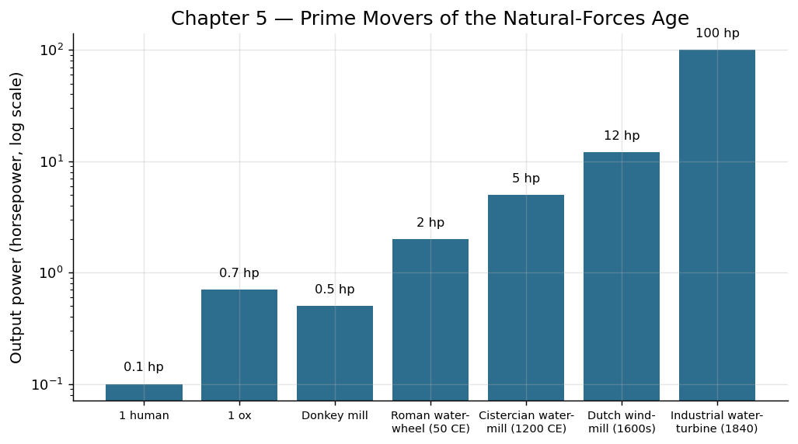

# 第五章 风与水：借用地球的引擎

## 尼罗河上的第一面帆

公元前三千五百年左右的某个清晨，一位埃及渔夫在尼罗河边做了一件看似微不足道的事——他把一块兽皮绑在竹竿上，竖立在自己的芦苇筏上。北风鼓起那块粗糙的皮革，筏子不借助桨板，缓缓向南逆流而上。那一刻，他可能只觉得手臂轻松了一些；他不会意识到，人类第一次把大气环流的能量转化成了有方向的运动。

在此之前，水上运输全靠人力划桨。一名壮年桨手持续输出的功率大约为 75 瓦，一艘 20 人桨船的动力上限约为 1500 瓦。而一面面积仅 10 平方米的简易方帆，在 5 级风（约 10 米/秒）中可以提取约 2000 瓦的有效推力——轻松超越 20 名桨手。风不知疲倦，不需要食物，也不会反抗。

## 帆船：贸易网络与全球化的原型

帆的出现催生了人类最早的远程贸易网络。埃及人利用尼罗河南向的风和北向的水流，建立了上下埃及之间稳定的双向物流通道。腓尼基人驾驶帆船穿越地中海，把锡从不列颠运到黎凡特，把紫色染料从提尔运到克里特。到了公元前一千年，一条从红海到印度洋的季风航线已经形成——商人们学会了利用印度洋上半年吹向东北、下半年吹向西南的季风规律，使航行变得可预测。

贸易带来了专业化分工。一个不靠海的内陆村庄不必再费力自己开采铜矿，它可以用粮食去换取远方运来的金属工具。经济学家所说的"比较优势"，在帆船时代第一次大规模发挥作用。帆船把一个又一个孤立的本地经济体编织成区域网络——这是今天全球化的原型。

从生产力角度衡量：一吨货物依靠人力搬运一百公里，需要大约 20 个人日；装上驮畜需要 5 个畜力日；而一艘中等帆船可以在同等时间内把几十吨货物运过几百公里的海路。单位运输成本下降了一到两个数量级，这意味着更远距离的贸易变得有利可图，更多产品进入流通——全社会可获取的物资总量因此增长。

## 水磨与风车：第一批"无人值守"的动力装置

如果说帆船让风力服务于运输，那么水磨则让流水的力量服务于制造。

公元前一世纪，罗马工程师维特鲁威记述了一种垂直水轮磨坊：河水冲击底部的叶片，带动水轮旋转，经由一套木齿轮将旋转传递给上方的磨石。一座典型的罗马水磨功率约为 2-3 千瓦，相当于 30 到 40 名奴隶同时推磨的输出。不同之处在于：水磨全天候运转，只需一人看管投料和维护。

这是一个深刻的跃迁。在此之前，所有"制造"动作——研磨、捶打、锯切——都需要人类肌肉实时介入。水磨第一次实现了"动力"与"操作者"的分离。看管磨坊的人不再是动力来源，而是动力的监督者。他的角色从"发动机"变成了"工程师"。

到了中世纪欧洲，水磨无处不在。1086 年英格兰的《末日审判书》记载了 5624 座水磨——平均每 50 户家庭就有一座。它们不仅研磨谷物，还被改造用于漂洗毛呢、锻打铁器、锯切木材和制作纸张。水力成为中世纪欧洲最重要的工业动力来源。

风车稍晚出现。12 世纪，波斯人建造了已知最早的风车，用于灌溉和研磨。13 世纪，风车传入低地国家（今荷兰、比利时），并在那里得到了最充分的发展。荷兰人用风车排水造田——他们从大海手中夺回的土地，几乎全靠风车网络维护。一座典型的荷兰排水风车输出功率约 30 千瓦，24 小时可以将数千立方米的水抬升到海平面以上。没有风车，就没有荷兰那一半国土。

## 功率的概念萌芽：从"人日"到"磨坊日"

当社会开始系统使用水磨和风车时，一种新的计量方式悄然诞生。中世纪的庄园账本中，不再仅以"需要多少农夫干多少天"来核算任务，而是开始出现"一座磨坊一天可研磨多少蒲式耳谷物"的记录。这是一种原始的"功率"概念——关注的不再是一个人的劳作时间，而是一台机器的持续输出能力。

这种思维转变意义重大。它把"生产力"从一种与人的体力和意志紧密绑定的东西，变成了一种可以独立于人存在的、可测量、可比较、可累加的物理量。后来瓦特定义"马力"这个单位时，他做的本质上是同一件事——只是更精确、更标准化。

我们可以粗略量化这场跃迁的规模：

- 一名壮劳力的持续输出功率：约 75 瓦
- 一头牛的持续输出功率：约 500 瓦
- 一座中世纪水磨：约 2000-5000 瓦
- 一座大型荷兰风车：约 20000-40000 瓦

从人力到风水动力，可用功率提高了两个数量级。更关键的是，这些功率是"免费"的——风和水不收取工资，不需要喂养（相比畜力），也不会因瘟疫而突然消失。

## 历史影响：中世纪的"隐形工业革命"

历史学家有时把 10 至 13 世纪欧洲的水磨、风车大扩张称为"中世纪工业革命"。这个说法并不夸张。在这段时期，欧洲的人口从约 3500 万增长到约 7500 万，农业产出大幅提高，城镇兴起，纺织业和冶金业蓬勃发展——而这一切的底层支撑之一，就是遍布乡间的水磨和风车所提供的廉价动力。

风力和水力还改变了社会结构。建造一座磨坊需要相当的资本投入（选址、土木工程、机械制作），这使磨坊成为中世纪最早的"资本密集型"生产设施之一。围绕磨坊的所有权、使用权和收费权，产生了复杂的经济和法律关系——领主的"磨坊垄断权"、农民的"强制磨粉义务"、以及后来反抗这些垄断的社会运动。某种意义上，围绕水磨的制度博弈，是后来围绕工厂的阶级冲突的一次预演。

## 与"驾驭"主题的呼应

风和水是地球自身运转的副产品——太阳辐射驱动大气环流产生风，重力驱动水流向低处。这些能量在人类出现之前就已经存在了亿万年，浩瀚无匹，却又散漫无方向。

帆、水轮和风车所做的，是在这股巨大的自然力流中插入一个"接口"——一片帆布、一组叶片、一副齿轮——把弥散的能量收集起来，转化为可控的机械运动。人类不能改变风向，不能命令河流倒流，但可以选择在哪里建坝、向何处张帆。驾驭的本质，就是在自然法则的约束之内找到杠杆点，用智慧换取力量。

这一章里，人类从"自己做发动机"毕业了。从此以后，人的角色开始向设计者、调度者和监管者转移——这条线索将一直延伸到蒸汽时代、电气时代，直到今天的算法时代。

---

**驾驭时刻：** 人类第一次学会在永不停歇的自然力流中安装"接口"，把地球自身的引擎变成自己的动力来源——从此，生产力不再被肌肉的上限所束缚。
