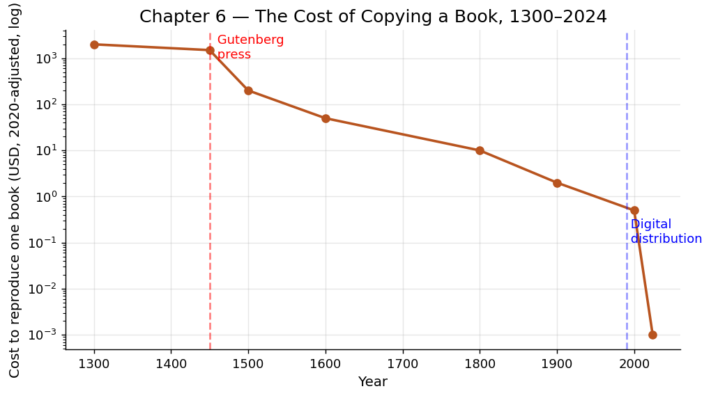

# 第六章 文字与印刷：信息生产力的第一次爆发

## 一块泥板上的四千年

1929 年，考古学家在伊拉克乌尔城的废墟中挖出一批楔形文字泥板。其中一块记录着大约公元前 2100 年的内容：一份大麦仓库的出入账目——收入多少、支出多少、余额多少，旁边还有管理员的签名印记。这不是诗歌，不是祈祷文，而是一份会计报表。

这个事实揭示了一个经常被忽略的真相：文字最初的发明动机不是为了记录神话或抒发情感，而是为了管理。当一个社会的粮食交易量超过了任何一个人的记忆容量时，它就必须发明一种外部存储系统——文字应运而生。

在文字出现之前，人类的所有知识都只能存储在活人的大脑里，通过口耳相传进行传递。一个部落长者的死亡，可能意味着整套医药知识或天文观测记录的永久丧失。知识的积累受限于人的寿命和记忆力，这就是所谓的"大脑带宽限制"。

## 文字作为"外部记忆"——突破大脑带宽限制

让我们用信息论的视角来理解文字的意义。

人类大脑的工作记忆容量大约为 7 加减 2 个信息组块（米勒定律）。长期记忆虽然容量巨大，但提取不可靠、会扭曲、且无法直接共享给他人。口头传播的信息衰减速度惊人——一条消息经过 5 次口耳转述后，核心内容的保留率通常不足 30%。

文字彻底改变了这一切。一旦信息被刻在泥板上、写在莎草纸上、铸在青铜器上，它就脱离了任何个人大脑的限制：

- **持久性**：信息可以跨越时间传递，不再受制于人的寿命。乌尔城那块泥板上的数据在四千年后仍然可读。
- **精确性**：书面记录不会像口头传说那样在传播中走样。一条法律条文无论被多少人阅读，内容都不变。
- **可检索性**：大量信息可以被组织、分类、索引，使得查找成为可能。古代图书馆的目录系统就是最早的"搜索引擎"。
- **可并行性**：同一份文本可以同时被不同地点的多人阅读和使用，打破了口头传播的"一对一"瓶颈。

这些特性使文字成为人类第一种真正意义上的"信息技术"。它把大脑从"既当处理器又当硬盘"的困境中解放出来，让人可以把记忆的负担外包给物质媒介，而将宝贵的认知资源集中于思考、判断和创造。

## 文字对生产力的倍增效应

文字的出现直接催生了一系列生产力飞跃：

**行政管理的规模化。** 没有文字，一个管理者能够可靠掌控的组织规模上限大约是 150 人（邓巴数）。有了文字——账本、命令、法典——一个官僚体系可以管理数百万人的帝国。古埃及、古巴比伦、古中国的大型帝国无一例外都建立在文字行政系统之上。文字使得"远程管理"成为可能：法老的命令可以被准确传递到几百公里外的省份，不会因为传令兵的记忆偏差而走样。

**技术知识的累积。** 在口头时代，一个工匠穷尽一生掌握的技术，很难完整传给下一代。文字时代，一本技术手册可以把一百代工匠的经验叠加在一起。知识不再从零开始，而是在前人的基础上持续积累。牛顿所说的"站在巨人的肩膀上"，前提是有文字把巨人的成果保存下来。

**合同与法律。** 文字使得复杂的商业合约成为可能。当交易双方可以把条款写成白纸黑字时，信任不再完全依赖于个人关系和口头承诺。这降低了交易成本，使得陌生人之间的大规模贸易变得可行。

## 活字印刷：知识复制成本趋近于零

如果说文字解决了信息的存储问题，那么印刷术解决的则是信息的复制问题。

在印刷术出现之前，书籍只能通过手工抄写复制。一名熟练的中世纪欧洲抄写员每天大约能抄写 3000-4000 个单词，一本《圣经》需要大约一年时间才能抄完一本。一本手抄书的价格相当于一个普通家庭数年的收入。知识被物理上锁在了昂贵的羊皮纸卷里，只有教会和贵族才能负担得起。

1040 年前后，中国的毕昇发明了胶泥活字印刷。1450 年前后，德国的约翰内斯·古腾堡发明了金属活字印刷机。两者的核心原理相同：把文字拆解为可重复使用的标准化部件（活字），通过排列组合来"组装"任何一页内容，然后用机械压力批量复制。

古腾堡的印刷机效率惊人：一台印刷机一天可以印出约 3600 页，而一名抄写员同期只能抄写约 4-5 页。生产率提升了将近 1000 倍。更重要的是，复制的边际成本急剧下降——第一本书的排版成本很高，但此后每增加一本的额外成本微乎其微。

让我们用数字感受这场变革：

- 1450 年古腾堡开始印刷时，全欧洲的书籍总量估计约为数百万册（全部手抄）。
- 到 1500 年（仅仅 50 年后），欧洲已经印刷了约 2000 万册书籍。
- 到 1600 年，这个数字达到了约 2 亿册。

书籍价格随之暴跌。15 世纪末，一本印刷书的价格只有同等手抄本的约五分之一到十分之一。阅读不再是贵族特权，知识开始向中产阶级、甚至部分平民阶层渗透。

## 为什么信息工具也是生产力工具

有人或许会问：磨坊研磨粮食、帆船运输货物，这些显然是"生产力工具"；但文字和印刷只是处理信息，它们如何提高物质生产力？

答案在于：在任何一个超越最原始规模的经济体中，协调成本（coordination costs）是生产力的主要瓶颈之一。一个能准确传递指令的文书系统、一套能被千人共读的操作手册、一份能让陌生人互信的合同模板——这些信息工具所节省的，不是体力，而是摩擦。它们使得分工更精细、协作更广泛、创新更快速。

印刷术的经济影响可以从多个角度衡量：

**教育普及。** 印刷使教科书变得廉价，识字率大幅上升。1500 年欧洲男性识字率约 5-10%，到 1800 年已升至 50-60%。识字人口的增加意味着更多人可以阅读技术手册、参与复杂的商业活动、进行科学研究。

**科学革命。** 16-17 世纪的科学革命很大程度上依赖于印刷术。科学家可以通过印刷出版物快速分享发现，其他人可以验证、批评和改进。哥白尼的《天体运行论》、牛顿的《自然哲学的数学原理》之所以能产生深远影响，前提是它们能被数千人同时阅读。

**标准化。** 印刷带来了前所未有的文本一致性。同一本航海手册的一千个副本内容完全相同——这在手抄时代是不可能的。标准化的技术文档使得大规模制造中的质量控制成为可能。

## 历史影响：从宗教改革到启蒙运动

印刷术的社会冲击波远超技术层面。1517 年，马丁·路德把他的《九十五条论纲》付诸印刷，两周之内传遍全德意志。如果没有印刷术，路德的抗议可能只是又一次被迅速镇压的地方性异议。印刷术使得思想的传播速度第一次超过了权力机构的反应速度——这彻底改变了政治博弈的规则。

宗教改革、启蒙运动、科学革命、民族主义——这些塑造了现代世界的巨大力量，无一不以印刷术为基础设施。本尼迪克特·安德森在《想象的共同体》中指出，"民族"这个概念本身就是印刷资本主义的产物：当成千上万互不相识的人每天早晨阅读同一份报纸时，他们开始想象自己属于同一个共同体。

## 与"驾驭"主题的呼应

前面几章的"驾驭"都是对物质能量的驾驭——火的热能、畜力的机械能、风和水的动能。这一章，驾驭的对象变了：人类开始驾驭信息本身。

文字驾驭的是"遗忘"——对抗时间对记忆的侵蚀。印刷驾驭的是"稀缺"——对抗知识传播的物理瓶颈。两者合在一起，使人类的集体智慧第一次能够跨越时空进行累积和放大。

如果说物质工具延伸了人的手臂，那么信息工具延伸了人的大脑。一个人的思考成果，经由文字和印刷，可以被百万人同时使用而不损耗——这是物质资源永远做不到的事情。信息具有天然的"非竞争性"，而文字和印刷把这种特性从潜能变成了现实。

从生产力史的角度看，这一章标志着一条与物质技术平行但同样重要的演化路线的起点：信息技术路线。这条路线将从文字经印刷、电报、计算机，一直延伸到今天的互联网和人工智能。每一步的本质都相同——用更低的成本复制和传播更多的信息，从而降低协调摩擦、加速知识积累。

---

**驾驭时刻：** 人类学会了把转瞬即逝的思想固化为持久的符号，再用机械的力量将其无限复制——从此，知识可以像物质一样被"生产"，而大脑的带宽不再是文明进步的天花板。
