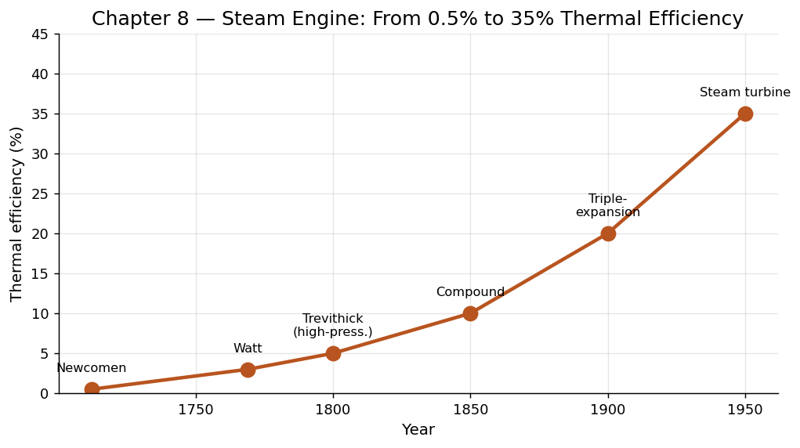

# 第 8 章　蒸汽机：把热变成功

## 一、矿井里的绝望

1712 年，英格兰中部斯塔福德郡的一座煤矿正在被地下水淹没。矿工们用马匹拖拽水桶，日夜不停，但涌水的速度远快于排水的速度。矿主面临一个残酷的选择：要么找到新的排水方法，要么放弃这座利润丰厚的矿井。

就在这一年，铁匠出身的托马斯·纽科门（Thomas Newcomen）带着他笨重的机器来到了矿井旁。这台机器有一个巨大的黄铜汽缸，顶上连着一根杠杆式横梁，看上去像一只不停点头的铁鸟。当蒸汽灌满汽缸后，冷水喷入，蒸汽骤然凝结为水，汽缸内形成真空，大气压便把活塞向下推——横梁另一端的水泵随之抬起，矿井深处的积水被一口口地吸了出来。

这就是人类历史上第一台实用的蒸汽机。它笨拙、低效、吞噬大量煤炭，但它做到了马匹和人力无法做到的事情：它不知疲倦。

## 二、从纽科门到瓦特：效率的觉醒

纽科门机的热效率不到 1%。也就是说，燃烧 100 份煤炭的热量，只有不到 1 份变成了有用的机械功，其余全部散失了。这个数字今天听来令人瞠目，但在当时已经足够——因为煤矿旁边最不缺的就是煤。

真正的变革发生在六十年后。1769 年，苏格兰仪器修理工詹姆斯·瓦特（James Watt）对格拉斯哥大学的一台纽科门机模型进行维修时，敏锐地发现了问题所在：每一次循环，冷水不仅凝结了蒸汽，还把整个汽缸冷却了；下一次循环又要重新加热汽缸，这是巨大的浪费。

瓦特的解决方案堪称优雅：在汽缸外面另设一个独立的冷凝器。蒸汽被引到冷凝器中凝结，而汽缸本身始终保持高温。这个看似简单的改动，将热效率提升了三到四倍。

但瓦特并没有止步于此。在随后的二十年里，他引入了双动式汽缸（活塞两侧都能做功）、行星齿轮传动（将往复运动转化为旋转运动）、离心调速器（自动控制转速）和压力指示器。到 1800 年前后，瓦特的蒸汽机已经不再只是一台水泵，而是一台可以驱动任何机械的通用动力源。

这里隐藏着一条深刻的物理学原理，后来被卡诺（Sadi Carnot）在 1824 年明确表述为热力学第二定律的雏形：热量自发地从高温流向低温，而要将热变成功，必须在温差之间运作。蒸汽机的本质，就是在锅炉的高温和冷凝器的低温之间架设一座桥梁，让热量"流过"时顺便推动活塞。温差越大，理论效率越高。纽科门机的温差太小，瓦特扩大了温差——这就是效率飞跃的物理根源。

## 三、生产力的量化飞跃

瓦特本人发明了"马力"（horsepower）这个单位，用来向客户推销他的机器。他测定一匹健壮的矿马每分钟能做 33,000 英尺·磅的功，然后宣称自己的蒸汽机相当于多少匹马。

让我们用现代数据来量化这场变革：

- 一个成年人持续做功的能力约为 75 瓦（0.1 马力）。
- 一匹马的持续输出约为 750 瓦（1 马力）。
- 纽科门机的典型输出约为 5.5 马力，相当于 55 个人或 5 匹马同时不停劳作。
- 瓦特晚期的旋转式蒸汽机输出可达 40 马力以上，相当于 400 个劳动力。
- 到 19 世纪中叶，大型工厂蒸汽机的功率已达数百马力，一台机器便可驱动整座工厂的数十台机床。

这意味着什么？意味着人类第一次大规模地将化石能源中储存了数亿年的太阳能，按照自己的意愿释放出来，转化为机械运动。肌肉的时代，终于迎来了一个真正的竞争者。

## 四、工厂制度的诞生：从分散到集中

在蒸汽机出现之前，纺织、铁匠、制陶等行业多半以"家庭手工业"的形式存在——工匠在自己家中劳动，节奏由自己控制。水力磨坊虽然提供了集中动力，但受制于河流位置，无法随意选址。

蒸汽机彻底改变了这一切。它不需要河流，只需要煤和水。于是工厂可以建在任何地方——尤其是靠近煤矿和运输节点的城市。工人被聚集到同一屋顶下，围绕一台中央蒸汽机排布的传动轴和皮带工作。生产节奏不再由人的疲劳感决定，而由机器的转速决定。

这就是"工厂制度"（factory system）的起源。它带来了前所未有的产出效率，也带来了严酷的劳动纪律、童工问题和城市化的种种阵痛。曼彻斯特在 1800 年到 1850 年间人口从 7.5 万暴增至 30 万，成为世界上第一座真正意义上的工业城市。恩格斯后来在这里写下了《英国工人阶级状况》。

生产力的本质在这里发生了一次质变：它不再仅仅是"一个人能做多少事"，而变成了"一套由能源驱动的系统能做多少事"。个体的体力上限不再是瓶颈，系统的组织方式和能源供给量才是。

## 五、铁路：时间和空间的压缩

如果说工厂是蒸汽机在"生产"维度的胜利，那么铁路就是蒸汽机在"流通"维度的胜利。

1825 年，斯蒂芬森（George Stephenson）的蒸汽机车在英国斯托克顿到达灵顿之间跑出了第一趟商业铁路。到 1850 年，英国已铺设了超过 6,000 英里的铁路网；到 1869 年，美国横贯大陆铁路贯通，从纽约到旧金山的旅程从六个月缩短到六天。

铁路的影响远超运输本身：

- **时间标准化**：铁路之前，每个城镇使用当地太阳时间。铁路要求统一时刻表，最终催生了标准时区制度。人类第一次在社会层面"统一"了时间。
- **市场一体化**：原本孤立的地方市场被铁路连成了全国性甚至全球性的大市场。曼彻斯特的棉纺厂可以将产品一周内送达伦敦港，再经轮船运往印度和中国。
- **规模经济**：铁路本身就是当时最大的产业。它催生了现代公司制度、股份融资、职业经理人阶层和标准化会计。铁路公司是人类历史上第一批"大企业"。

铁路将空间折叠，将时间标准化，将市场统一——它不仅运输货物，更运输了一种全新的社会组织逻辑。

## 六、驾驭时刻

> 蒸汽机的"驾驭"，是人类第一次将热能这种无形的、弥散的自然力量，约束在汽缸之中，转化为可控的、持续的机械运动——从此，人类的生产力不再被肌肉所限，而是被想象力和燃料储量所限。
