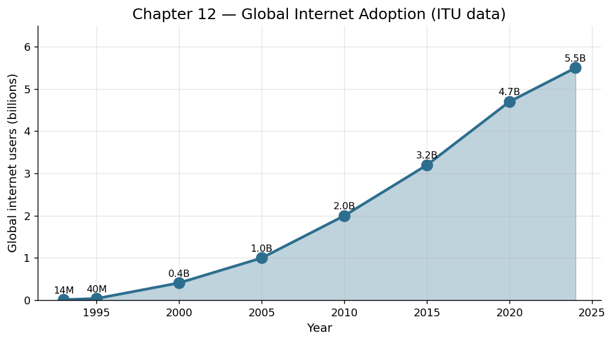

# 第 12 章 互联网：连接即生产力

## 一封需要五天的信

1969 年 10 月 29 日晚上十点半，加州大学洛杉矶分校的研究生查理·克莱恩试图通过一根电话线向 560 公里外的斯坦福研究所发送一个单词："LOGIN"。他输入了"L"，对方确认收到；输入"O"，对方确认收到；输入"G"——系统崩溃了。

人类通过计算机网络成功传输的第一条信息是"LO"。这个不完整的词组，今天回望，倒像是一声惊叹：Lo and behold——你瞧。

这个名为 ARPANET 的实验网络最初只有四个节点。没有人——包括它的缔造者——预见到这项技术会在三十年后重塑整个人类文明的生产方式。在那个年代，人与人之间的信息交换仍然昂贵而缓慢：一封跨国商业信函平均需要五天抵达；一通越洋电话的费用相当于普通工人一天的工资；查阅一篇学术论文可能需要到图书馆花费半天时间。

信息是有价值的，但获取和传递信息的成本，将这种价值牢牢锁在了距离和时间的牢笼中。

## 技术原理：分组交换与开放协议

互联网的核心技术思想是"分组交换"（packet switching）：将信息切碎为标准化的小数据包，每个包独立寻找路径到达目的地，再在接收端重新组装。这与传统电话网络的"电路交换"截然不同——后者需要为每次通话独占一条线路，而分组交换让所有人共享同一张网络，极大提高了线路利用率。

但比技术更重要的是设计哲学。互联网的缔造者做出了一个改变历史的决定：所有核心协议（TCP/IP、HTTP、SMTP）都是开放标准，任何人都可以免费使用、自由实现。这意味着没有任何一家公司可以"拥有"互联网，没有人需要支付"入网许可费"。正是这种开放性，让互联网像野火一样蔓延——1990 年全球联网主机不到 30 万台，到 2000 年已超过 3 亿台，2020 年全球联网设备超过 200 亿台。

1991 年，蒂姆·伯纳斯-李在欧洲核子研究中心发明了万维网（World Wide Web），提供了一种简洁直观的方式来发布和浏览信息。如果说 TCP/IP 是互联网的道路系统，那么万维网就是建在道路上的城市——有地址（URL）、有建筑（网页）、有导航（超链接）。从此，互联网不再是极客的玩具，而是每个人都能使用的信息公共空间。

## 信息传输成本：趋近于零

互联网对生产力的第一重冲击，是把信息传输的边际成本压低到几乎为零。

具体数字：1970 年，从纽约向伦敦传输一兆字节数据的成本约为 150,000 美元（折合今天的货币）。到 2000 年，同样的传输成本降至不到 0.01 美元。到 2020 年代，这个数字已经小到无法单独计量——人们按月付一笔固定的宽带费用，然后"无限"地传输数据。

这种成本坍缩的后果是深远的。当信息传递的价格趋近于零时，所有依赖信息不对称而存在的中间商都面临冲击：旅行社、报纸分类广告、证券经纪人、百科全书出版商。与此同时，新的商业模式得以诞生：电子邮件取代了传真和信件，在线购物取代了目录邮购，流媒体取代了唱片店和录像带租赁。

更深层的变化在于：当传递信息几乎不花钱时，人们开始愿意免费分享信息。这一转变催生了人类历史上最大规模的知识共享运动，从维基百科到 Stack Overflow，从学术预印本到开源代码。

## 平台经济与网络效应

互联网催生了一种全新的经济形态：平台经济。平台本身不生产商品，而是连接买家与卖家、创作者与消费者、问题与答案。亚马逊、淘宝、优步、Airbnb——这些公司的核心资产不是库存或厂房，而是"连接"本身。

平台的威力源于网络效应：每多一个用户加入，平台对所有现有用户的价值都会增加。一部电话机毫无用处，但当世界上有十亿部电话时，每一部都变得不可或缺。这种正反馈循环导致了"赢家通吃"的市场结构——搜索引擎、社交网络、即时通讯等领域，全球通常只存在一到三家主导平台。

从生产力角度看，平台经济的贡献在于：它极大地降低了"交易成本"。经济学家罗纳德·科斯在 1937 年提出，企业之所以存在，是因为在市场中寻找交易对手、协商价格、执行合同的成本太高，不如把这些活动纳入一个组织内部来管理。而互联网平台把这些交易成本压缩了几个数量级——你可以在几秒钟内在 eBay 上找到全球任何一个愿意出售你所需物品的人。

这意味着许多原本必须在企业内部完成的活动，现在可以通过市场来协调。自由职业者、小型工作室、个体创业者因此获得了前所未有的机会——他们可以通过平台触达全球市场，而不需要庞大的营销部门和销售渠道。

## 开源运动：协作的规模突破组织边界

1991 年，芬兰赫尔辛基大学的学生林纳斯·托瓦兹在 Usenet 上发布了一则消息："我正在做一个（免费的）操作系统，只是个人爱好，不会像 GNU 那样庞大和专业。"

三十年后，这个"个人爱好"——Linux——运行着全球超过 90% 的云服务器、100% 的超级计算机 500 强、以及大部分智能手机（通过 Android）。它由来自 1700 多家公司的数万名开发者共同维护，代码行数超过 2800 万行。没有任何一家公司、任何一个组织能够独力完成这样的工程。

开源运动代表了一种全新的生产组织方式：基于共同兴趣和声誉激励的大规模志愿协作。互联网让这种协作成为可能——分散在全球各地的开发者可以异步协作，通过版本控制系统（如 Git）跟踪每一次修改，通过邮件列表和论坛讨论设计决策。

从生产力的角度看，开源的意义在于它创造了巨大的"正外部性"。每一个开源项目都是一块免费的积木，后来者可以直接站在上面构建自己的产品，而不需要从零开始。2024 年，据估计全球商业软件中超过 90% 使用了开源组件。这相当于数千亿美元的研发投入被免费共享给了全人类。

开源的成功挑战了经济学的一个基本假设：人们只有在获得报酬时才会工作。事实证明，当协作的成本足够低、成果的可见性足够高时，内在动机（求知欲、声誉、利他主义、使用自己的作品的愿望）可以驱动令人难以置信的大规模协作。互联网不仅连接了机器，还连接了人类的善意和创造力。

## 生产力量化

互联网对生产力的贡献很难用单一数字概括，但以下几个维度可以勾勒其规模：

- **信息获取效率**：1990 年代，查找一个特定事实平均需要数小时（翻阅参考书、致电专家）；2010 年代，同样的查询用谷歌搜索只需几秒钟。麦肯锡估计，知识工作者每周花 19% 的时间"搜索和收集信息"——互联网可能将这一时间至少压缩了一半。

- **沟通效率**：电子邮件的速度是传统邮件的数千倍，成本几乎为零。即时通讯进一步将响应时间从小时级压缩到秒级。

- **市场效率**：电子商务消除了地理限制。一位中国深圳的制造商可以直接向美国爱荷华州的消费者销售产品，中间环节从五六层压缩为一两层。

- **GDP 贡献**：据世界银行估计，互联网普及率每提高 10 个百分点，发展中国家 GDP 增长率提升 1.38 个百分点。

## 历史影响：世界变平了吗？

托马斯·弗里德曼在 2005 年宣称"世界是平的"——互联网抹平了竞争的不平等，让任何地方的任何人都可以参与全球经济。

这个论断有一半是对的。确实，互联网让印度班加罗尔的程序员可以为硅谷公司远程工作，让肯尼亚的农民可以通过手机查询市场价格从而避免被中间商压价，让一个巴西的独立音乐人可以在 Spotify 上触达全球听众。

但世界并没有完全"变平"。互联网的价值分配高度不均：平台所有者捕获了大部分经济租金，而平台上的参与者（司机、房东、内容创作者）的议价能力往往很弱。数字鸿沟依然存在——全球仍有近三分之一的人口无法接入互联网。语言障碍、文化差异、监管壁垒继续划分着网络空间。

尽管如此，互联网作为人类生产力史上的一个里程碑地位是不可动摇的。它做到了此前没有任何技术做到的事情：让信息在全球范围内几乎即时、几乎免费地流动。而信息的自由流动，是一切市场效率、技术创新和知识积累的前提条件。

## 驾驭时刻

互联网时代的"驾驭"，是人类将信息传输的成本压缩至接近于零，从而把"连接"本身转化为一种生产力——当所有人的知识和需求都能瞬间互达时，协作的边界便不再受限于任何一个组织、一座城市或一个国家。
