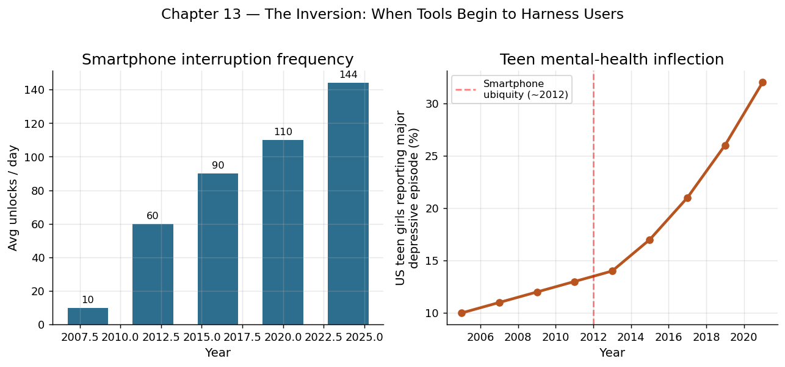

# 第 13 章 移动与云：随时随地的算力

## 口袋里的阿波罗

2007 年 1 月 9 日，史蒂夫·乔布斯站在旧金山莫斯科尼中心的舞台上，从牛仔裤口袋里掏出一块 3.5 英寸的玻璃屏幕。"今天，苹果重新发明了手机。"他说。

iPhone 并不是第一款智能手机，但它是第一款让普通人真正愿意把计算机装进口袋的设备。在此后的十七年里，智能手机从一件奢侈品变成了地球上最普及的计算设备——到 2024 年，全球活跃智能手机数量超过 50 亿部，覆盖了地球约 65% 的人口。

让我们做一个跨越时代的对比。1969 年将阿波罗 11 号送上月球的导航计算机，其 RAM 为 4KB，存储为 72KB，运行频率为 2.048MHz。今天一部中档智能手机的性能大约是它的一千万倍。人类用来登月的全部计算能力，现在连一个中学生口袋里的设备都比不上。

但性能只是故事的一半。智能手机之所以革命性，是因为它把计算能力与三个要素融为一体：无线通信（随时联网）、传感器阵列（GPS、加速度计、摄像头、麦克风）、以及贴身携带（24 小时不离身）。这三者的结合创造了一种前所未有的可能性——计算不再是你"去做"的事情（走到电脑前、坐下、开机），而是随时随地、无缝嵌入日常生活的背景能力。

## 技术原理：移动计算的三重突破

智能手机的诞生依赖于三个技术领域的同步成熟：

**第一，芯片的极致能效比。** 桌面处理器追求最大性能，功耗可以高达上百瓦；而手机处理器必须在几瓦的功率预算内提供足够的性能，因为电池容量有限且散热空间极小。ARM 架构的精简指令集设计恰好满足了这一需求——以更少的晶体管完成每条指令，从而大幅降低能耗。

**第二，无线通信的带宽革命。** 从 2G（每秒几十千比特）到 3G（每秒几兆比特）到 4G/LTE（每秒几十兆至百兆比特）再到 5G（理论峰值每秒数千兆比特），每一代移动通信技术都将带宽提升约十倍。高带宽意味着手机可以实时加载复杂内容——视频通话、高清地图、云端协作文档——而不仅仅是收发短信和邮件。

**第三，触控交互的革新。** 电容式多点触控屏消除了物理键盘的束缚，让屏幕既是输出设备又是输入设备。这使得同一块硬件可以通过软件变幻出无穷的界面形态——此刻是计算器，下一刻是钢琴，再下一刻是地图。应用商店模式（App Store）由此诞生：第三方开发者可以为这块玻璃屏幕编写任意功能，用户按需下载。

## 云计算：按需弹性的基础设施

如果说智能手机是"口袋里的计算机"，那么云计算就是"天上的计算机"——更准确地说，是分布在全球各地数据中心里的数百万台服务器，通过互联网按需向用户提供计算和存储能力。

云计算的理念可以追溯到 1960 年代——约翰·麦卡锡曾预言计算将像公用事业（水电煤）一样按需供给。但直到 2006 年亚马逊推出 AWS（Amazon Web Services），这一愿景才真正商业化。AWS 的核心洞察很简单：亚马逊为应对购物高峰（如"黑色星期五"）建设了大量闲置服务器，为什么不把这些闲置算力出租给其他人？

这个简单的想法引发了基础设施领域的根本变革：

- **从"购买"到"租用"**：企业不再需要预先购买昂贵的服务器并建设机房。它们可以按小时、按分钟甚至按秒购买算力，用多少付多少。
- **从"预估"到"弹性"**：传统 IT 必须预估峰值负载并据此采购——这意味着大部分时间资源都在闲置。云计算允许在数秒内扩容数百台服务器，也允许在负载降低时自动缩容。
- **从"维护"到"专注"**：企业不再需要雇佣大量运维人员来管理硬件、打补丁、处理故障。云服务商承担了这些工作，企业可以将全部精力集中在核心业务上。

云计算的经济影响是深远的。它几乎消除了技术创业的"基础设施门槛"——2005 年之前，创办一家互联网公司通常需要数十万美元来购买服务器；2006 年之后，同样的事情只需要一张信用卡和每月几百美元的 AWS 账单。这极大地降低了创新的试错成本，加速了"精益创业"模式的流行——快速试验、快速失败、快速迭代。

到 2024 年，全球云计算市场规模超过 6000 亿美元，超过 94% 的企业使用至少一种云服务。软件行业的主流交付方式已从"装在光盘里卖给你"转变为"运行在云端按月收费"（SaaS 模式）。

## 数据：新的"原油"

移动设备和云计算的结合产生了一个副产品——海量数据。50 亿部智能手机每时每刻都在产生数据：位置轨迹、搜索记录、购买行为、社交互动、健康指标。这些数据被上传至云端，汇聚为人类行为的巨型镜像。

2017 年，《经济学人》杂志在封面上宣布："数据是新的石油。"这个类比有其道理：正如石油是工业时代最重要的原材料，数据正在成为信息时代最重要的生产要素。但两者有一个关键区别——石油用了就没了，而数据可以被无限复制和重复使用，且使用过程中不会被消耗。

数据之所以成为生产力的源泉，核心在于"模式识别"。当你拥有数百万用户的行为数据时，你可以发现肉眼不可见的规律——哪些商品会被一起购买、哪些症状组合预示着疾病、哪条路线此刻最不拥堵、哪位用户即将流失。这些洞察直接转化为效率提升和商业价值。

机器学习——特别是深度学习——正是把数据转化为生产力的核心技术。神经网络需要海量数据来"训练"，而云端的算力使得训练大规模模型成为可能。移动设备负责采集数据，云端负责存储和处理，训练好的模型再部署回设备端为用户服务——这构成了一个正反馈循环：更多用户产生更多数据，更多数据训练出更好的模型，更好的模型吸引更多用户。

## 生产力量化

移动与云时代对生产力的影响可以从多个角度衡量：

- **劳动力利用率**：智能手机让"碎片时间"可以被利用——通勤时回复邮件、等待时审阅文档、午休时学习课程。据估计，移动办公使知识工作者平均每天多出 58 分钟的"有效工作时间"。
- **创业成本下降**：2000 年创办一家互联网初创公司的平均种子期支出约为 500 万美元；2015 年，同等功能规模的初创公司只需约 5 万美元。云计算、开源软件和应用商店分发渠道共同将创业门槛降低了两个数量级。
- **新兴市场接入**：在非洲和南亚，数十亿人直接跳过了 PC 时代，通过智能手机第一次接入数字经济。肯尼亚的 M-Pesa 移动支付系统让没有银行账户的农民也能进行电子转账，交易成本从传统汇款的 10-15% 降至不到 1%。
- **企业 IT 效率**：采用云计算的企业平均将 IT 基础设施成本降低了 30-40%，同时将新产品的上线时间从数月缩短至数天。

## 历史影响：永远在线的人类

移动与云时代带来了一种根本性的存在状态转变：人类从"偶尔上网"变成了"永远在线"。

这种转变的积极面是显而易见的：知识触手可及、沟通即时无碍、服务随叫随到。一位上海的设计师可以在地铁上与纽约的客户视频会议；一位巴西的学生可以在手机上学习 MIT 的课程；一位印度的农民可以通过 app 直接把蔬菜卖给城市消费者。

但"永远在线"也带来了前所未有的挑战。注意力经济让科技公司有强烈动机让用户尽可能长时间地盯着屏幕，即使这损害了用户的福祉。"数字疲劳"成为一种新的职业病——人们被永不停歇的通知、邮件和消息淹没，深度工作的时间被切割成碎片。隐私成为稀缺品——当你的手机 24 小时记录你的位置、通信和行为时，监控的可能性也达到了历史顶峰。

从劳动关系的角度看，移动技术模糊了"工作"与"生活"的边界。当老板可以在晚上十点给你发消息并期望即刻回复时，"下班"这个概念还存在吗？一些国家（如法国）已经立法规定"断联权"（right to disconnect），试图在技术便利与人的尊严之间划出界限。

"零工经济"（gig economy）是移动与云时代的另一个标志性产物。优步司机、外卖骑手、自由设计师——这些人通过手机 app 接受任务、完成工作、获得报酬。平台提供了灵活性，但也带来了不稳定：没有固定收入、没有社会保障、没有职业发展路径。这是一种全新的劳动形态，现有的法律和社会制度尚未完全适应。

## 与"驾驭"主题的呼应

回望本书的脉络：人类驾驭了火来烹饪和取暖，驾驭了牲畜来耕作，驾驭了水力和蒸汽来驱动工厂，驾驭了电力来照亮城市，驾驭了计算机来自动化逻辑，驾驭了互联网来消除距离。

移动与云代表了这条长链的最新一环：算力不再被困在桌面上或机房里，而是像水和电一样无处不在、随取随用。正如 19 世纪末的电气化让工厂从水力驱动的河边搬到了任何地方，21 世纪初的移动与云让计算从书桌前解放到了任何时间、任何地点。

但"驾驭"从来都是一枚双面硬币。更大的力量意味着更大的责任。当算力无处不在时，如何确保它服务于人的自由而非束缚人的自由？这个问题将贯穿信息时代的下一幕。

## 反面：当工具开始驾驭使用者

本书走到这里，"驾驭"一词从来都是人作为主语：人驾驭火、人驾驭马、人驾驭蒸汽、人驾驭电、人驾驭比特。但从智能手机这一章开始，主谓关系第一次出现了悄无声息的倒转——当那块 6 英寸的玻璃屏幕成了你睁眼第一件触碰、睡前最后一件放下的物品时，到底是你在驾驭它，还是它在驾驭你？

**注意力经济：被工程化的多巴胺。** 根据 Asurion 和 RescueTime 等机构 2019 到 2023 年间的多次测算，美国成年用户平均每天解锁手机 80 到 110 次，重度用户超过 150 次，平均屏幕使用时间在 3.5 到 4.5 小时之间——也就是说，一个普通人每年盯着手机的时间相当于完整的两个月。这并不是偶然。Tristan Harris——前 Google 设计伦理学家、"人道科技中心"（Center for Humane Technology）创始人——在多次公开演讲和 Netflix 纪录片《社交困境》中详细描述了这件事的内部机制：每一个红点通知、每一次下拉刷新、每一段无限滚动的信息流、每一条"还有 3 个好友也喜欢"的提示，背后都是一个由数百名工程师和行为科学家组成的团队，在 A/B 测试用户在哪个微表情、哪个像素位置上最容易停下手指。Harris 用了一个尖锐的类比：你口袋里那台设备的另一端，有上千名世界上最聪明的人专门负责打败你的自控力——你不可能赢。

**数字成瘾与一代人的心理危机。** 心理学家 Jean Twenge 在《i 世代》（iGen, 2017）中提出了一个引发广泛讨论的相关性：美国青少年的抑郁、焦虑、自杀率从 2010 到 2012 年前后出现明显拐点——恰好是智能手机渗透率突破 50%、Instagram 普及的时间窗口。CDC 的数据显示，2009 到 2021 年间美国高中女生"持续感到悲伤或无望"的比例从 26% 上升到 57%；同期 10 到 14 岁女孩的自杀率上升了约 2 倍。Jonathan Haidt 在《焦虑的一代》（The Anxious Generation, 2024）中进一步整合了多国数据，把这一现象命名为"基于手机的童年"（phone-based childhood）对"基于游戏的童年"的替代，并主张推迟青少年接触智能手机和社交媒体的年龄。相关性是否等于因果至今仍有学术争论，但全球范围内青少年心理健康指标在 2010 年后同步恶化、且与日均屏幕时间高度相关，这一基本事实已很难被否认。

**算法管理与"困在系统里"的劳动者。** 移动与云的另一个产物，是用算法把每一个劳动者实时调度、实时计价、实时考核。2020 年《人物》杂志一篇题为《外卖骑手，困在系统里》的报道引爆了中文互联网：美团和饿了么的派单算法每年都在压缩配送时限，"3 公里 30 分钟"被改为"3 公里 28 分钟"再改为"3 公里 26 分钟"，骑手们为了不被系统扣分被迫闯红灯、逆行、超速。中国上海等地的研究估计，外卖骑手日均交通事故发生率显著高于其他职业司机。优步司机面临类似处境：动态定价算法在高峰时段调高单价吸引司机上线，等司机就位后再悄悄回落；下线时机、接单顺序、评分门槛都由不透明的算法决定，司机连"老板是谁"都不知道。Cathy O'Neil 在《数学杀伤性武器》（Weapons of Math Destruction, 2016）中把这类系统命名为 WMD——它们规模巨大、不透明、且产生自我强化的负面反馈：被算法判定为"高风险"的求职者更难获得面试，更难获得面试就更可能长期失业，长期失业又会反过来强化算法对其的负面评分。

**监控资本主义：行为数据成为原材料。** 上一节我们把数据称作"新的石油"，但 Shoshana Zuboff 在《监控资本主义时代》（The Age of Surveillance Capitalism, 2019）中提出了一个更不浪漫的命名：人类行为本身——你的位置轨迹、停留时长、滑动速度、瞳孔反应——被持续采集，加工成"行为剩余"（behavioral surplus），用以训练预测模型，再把预测结果卖给广告商或保险公司。这是一种历史上前所未有的资本积累方式：原材料不是地里的矿石，也不是工人的体力劳动，而是用户在不知情情况下交出的内在生活。2018 年的剑桥分析事件给这种模式提供了最具体的案例——一家政治咨询公司通过 Facebook 的一个第三方应用收集了约 8700 万用户的个人数据，再据此构建心理画像，向特定选民投放定制化政治广告，被指影响了 2016 年美国大选和英国脱欧公投。事件曝光后 Facebook 被罚款 50 亿美元，剑桥分析公司倒闭，但这种业务模式本身并没有消失，只是变得更加隐蔽。

**算力的地理不均等。** 移动设备的普及看似让算力平等地落到了每个人手里，但真正决定信息时代权力分布的是另一层——云端的数据中心。2024 年，全球公有云市场约 70% 的份额由三家美国公司（AWS、Microsoft Azure、Google Cloud）占据；阿里云和腾讯云在中国市场领先，但海外渗透有限；印度、东南亚、非洲、拉美几乎完全依赖境外云服务商。一个肯尼亚的初创公司想要训练一个机器学习模型，它的数据多半要上传到弗吉尼亚州或爱尔兰的服务器——这意味着数据主权、定价权和技术依赖都掌握在他人手中。这一格局比 19 世纪的殖民贸易更隐蔽，但权力的非对称是类似的。

回头看本章开头那个比喻：iPhone 是"口袋里的阿波罗"。但阿波罗 11 号的导航计算机只服务一个目的——把宇航员安全送到月球和送回家。它不会在凌晨两点震动一下让宇航员去刷一段 15 秒的舞蹈视频，它也不会把宇航员的心跳数据偷偷卖给保险公司。当算力变得无处不在的同时，它服务的目的也变得无处不在——其中很大一部分目的并不属于使用者本人，而属于那些设计算法、运营平台、买卖数据的第三方。

这是 harness 这个词在本书中第一次显露出讽刺意味。前十二章里，被 harness 的总是某种外在于人的自然力——风、火、水、电、原子。到第十三章，被 harness 的对象第一次包含了使用者自己：你的注意力被 harness 进了广告拍卖系统，你的位置被 harness 进了精准营销模型，你的疲惫和孤独被 harness 进了短视频算法的留存曲线。每一次"驾驭"都是双向的——当你以为是你在用智能手机做事时，它也在用你做事。

承认这一点并不是要否定移动与云时代的成就。前面那些数字——50 亿台联网设备、消失的创业门槛、M-Pesa 解放的非洲农村金融——都是真实的。但它们必须与本节的另一组数字并列阅读：每天 110 次解锁、上升一倍的青少年自杀率、困在系统里的外卖骑手、剑桥分析的 8700 万被泄露用户。生产力史既是一部驾驭史，也是一部被驾驭史；从这一章开始，这两者第一次发生在同一群人身上。

## 驾驭时刻

移动与云时代的"驾驭"，是人类将算力从固定的机器中解放出来，使其如同空气和水一般弥散于每一个时刻和角落——让数十亿人随时随地拥有曾经只属于超级计算中心的能力，而数据则成为驱动这一切持续演进的新燃料。
