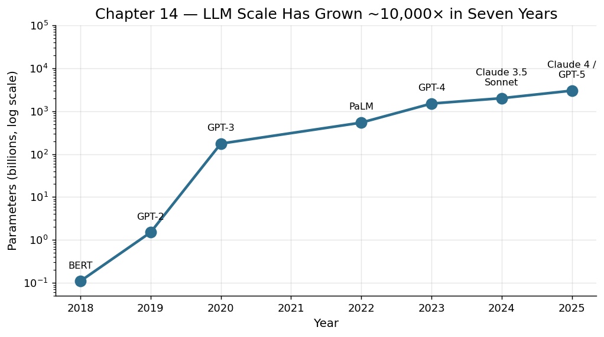

# 第 14 章　大语言模型：语言即接口

## 一封写给机器的信

2022 年 11 月 30 日，一个寻常的星期三，OpenAI 悄悄上线了一个聊天界面。没有发布会，没有广告投放，只是一条推文和一个链接。五天后，ChatGPT 的用户数突破一百万。两个月后，突破一亿[^1]。在人类技术传播史上，没有任何产品以这样的速度抵达如此多的人。

但真正令人震惊的不是增长曲线，而是人们与它交流的方式——他们只是在打字，用日常语言，像写一封信那样，告诉机器自己想要什么。不需要学习编程语法，不需要理解数据库查询语句，不需要点击层层嵌套的菜单。一位从未写过代码的小学教师让它生成了课堂测验；一位退休老人让它解释自己的体检报告；一位律师让它梳理了一份合同中的风险条款。

这一刻，人类与机器之间最古老的屏障——"你必须学会机器的语言才能命令它"——轰然倒塌。

语言，人类最古老的工具，成为了驾驭最新机器的接口。

## 从规则到统计：漫长的攀登

要理解这一刻何以到来，我们需要回溯半个多世纪的探索。

**规则系统时代（1950s-1980s）。** 早期的自然语言处理像是在编写一本无限厚的词典和语法书。语言学家和工程师手工编写规则："如果句子结构是'主语+动词+宾语'，则……"这种方法在受限场景下有效——比如航班查询系统能理解"从北京到上海明天的航班"——但面对日常语言的歧义性和创造性，规则系统迅速力不从心。"我用望远镜看到了一个拿望远镜的人"这样的句子，足以让规则引擎陷入死循环。

**统计学习时代（1990s-2010s）。** 研究者转向了另一条路径：与其告诉机器语言是什么，不如让它从海量文本中自己发现规律。n-gram 模型、隐马尔可夫模型、支持向量机，一系列统计方法将自然语言处理从手工作坊推进到流水线阶段。机器翻译不再依赖双语词典，而是从数百万对照译文中学习对应关系。这条路走了二十年，效果稳步提升，但始终有一道天花板：这些模型理解的是局部模式，而非全局语义。它能翻译一个句子，但不能理解一段论证。

**深度学习与词向量（2013-2017）。** Word2Vec 的出现带来了一个迷人的发现：如果用神经网络将每个词映射为一个高维向量，这些向量之间会自发涌现出语义关系。"国王 - 男人 + 女人 = 女王"——这个著名的类比运算表明，语义可以被几何化[^2]。随后，循环神经网络（RNN）和长短期记忆网络（LSTM）让模型能够处理序列信息，机器翻译的质量出现了质的飞跃。

但真正的革命还在酝酿。

## Transformer：注意力就是一切

2017 年，Google 的一组研究者发表了一篇论文，标题简洁而自信：《Attention Is All You Need》（注意力就是你所需要的一切）[^3]。这篇论文提出了 Transformer 架构，它的核心思想出奇地直觉化：在理解一个词的含义时，不需要按顺序逐个阅读前面的每个词，而是可以同时"注意"到句子中所有相关的部分。

想象你在读一本侦探小说。当你在第 300 页读到"凶手终于露出了马脚"时，你的大脑会同时闪回第 15 页的那个可疑细节、第 87 页的不在场证明、第 201 页的矛盾供词。这种跨越距离的关联能力，就是"注意力机制"的本质。

Transformer 的另一个关键优势是并行计算。不同于 RNN 必须逐词处理的串行方式，Transformer 可以同时处理整个序列中的所有位置关系。这意味着它能够充分利用 GPU 的并行计算能力，而 GPU 恰恰是那个时代算力增长最快的硬件。架构与硬件的共振，释放出了巨大的能量。

## 涌现：为什么规模带来质变

接下来发生的事情，连研究者自己也未能完全预见。

当研究者将 Transformer 模型的参数规模从数亿扩大到数十亿、再到数千亿时，模型并非只是"更好了一点"。在某些任务上，它突然从"完全不会"跳跃到"相当熟练"，就像水被加热到 100 度时突然沸腾。这种现象被称为"涌现能力"（emergent abilities）[^4]。

GPT-3 拥有 1750 亿参数[^5]。它不仅能写出通顺的文章，还能进行算术运算、翻译未见过的语言对、编写代码——尽管它从未被明确训练做这些事。更令人惊讶的是"思维链"（chain-of-thought）能力的涌现：当你要求模型"一步步思考"时，它会展示推理过程，而且推理的准确率因此大幅提升[^6]。

涌现能力的本质仍是学术界争论的焦点。一种解释是：当模型足够大时，它内部形成了丰富的"表征空间"，不同的知识片段得以建立跨领域的连接。就像一座城市，当人口密度超过某个阈值，创新就会自发涌现——因为不同领域的人开始偶遇、碰撞、重组想法。

## 自然语言成为通用编程语言

让我们回到那个最深刻的变化：语言成为了接口。

在整个计算机历史中，人类为了与机器沟通，不断发明中间语言。机器语言、汇编语言、FORTRAN、C、Python——每一代编程语言都在试图缩短人类意图与机器执行之间的距离。但无论多么"高级"，编程语言终究是一套需要学习的形式系统，拥有严格的语法规则和精确的语义约束。

大语言模型打破了这个范式。当你用自然语言对模型说"帮我写一个 Python 函数，输入一个列表，返回其中所有偶数的平方和"时，你实际上是在用人类语言编程。自然语言不再只是描述需求的工具，它本身就是指令。

这意味着什么？它意味着数十亿人——所有会说话、会写字的人——突然都获得了"编程"能力。不是比喻意义上的编程，而是真正地指挥计算机完成复杂任务。一位市场经理可以要求模型分析销售数据并生成可视化报告；一位作家可以让模型帮助构思情节结构；一位医生可以请模型检索最新的临床研究并总结关键发现。

## 生产力的量化跃迁

这场变革对生产力的影响可以从多个维度衡量。

**写作与内容生产。** 根据多项研究，使用大语言模型辅助写作可以将初稿生成速度提升 40%-60%，同时保持或提高文本质量[^7]。对于非母语写作者，提升更为显著——模型有效地将语言壁垒从生产力方程中移除。

**编程。** GitHub 的数据显示，使用 AI 辅助编程工具的开发者完成任务的速度平均提升 55%[^8]。更重要的是，初级开发者获得的增益远大于高级开发者——模型在某种程度上"民主化"了编程技能。

**知识检索与综合。** 在传统模式下，一个研究者可能需要花费数小时阅读论文、整理笔记、综合发现。大语言模型可以在数秒内完成初步综述，将研究者的时间释放给更高价值的批判性分析。

麦肯锡全球研究院估计，生成式 AI 有望为全球经济每年增加 2.6 至 4.4 万亿美元的价值——相当于为世界经济增加一个英国或法国的 GDP[^9]。

## 缰绳的松弛处：大语言模型的系统性局限

在为这项技术的成就喝彩之后，我们需要停下来做一件负责任的事：诚实地审视它的边界。任何一个驾驭工具——从马缰到方向盘——都有其失灵的工况。假装缰绳永远抓得紧，恰恰是失控的前兆。

**幻觉：自信的虚构**

2023 年，一位纽约律师向联邦法院提交了一份诉状，其中引用了六个判例。问题是，这六个判例全是 ChatGPT 编造的——案件名称、引用编号、裁判要旨，一切看起来无比真实，却从未发生过[^11]。这不是一个搞笑的个案，而是大语言模型最深层架构特征的外在表现。

LLM 的训练目标是预测"给定前文，下一个最可能的 token 是什么"。注意这里的关键词是"可能"，而非"真实"。模型从未被教导去区分事实与虚构；它只是在学习语言的统计分布。当你问它一个冷僻问题时，它不会说"我不知道"，而是流畅地生成一个"看起来像正确答案"的回复——因为流畅本身就是它的优化目标。

Emily Bender 等人在那篇引发广泛争议的"随机鹦鹉"论文中，精确地指出了这一点：语言模型操纵的是语言形式，而非语言所指向的世界意义[^12]。一只鹦鹉能完美模仿"着火了！"的发音，但它不理解火焰、温度或逃跑的必要性。大语言模型的幻觉问题本质上是相同的困境——它操纵符号的能力远远超过了它锚定符号与世界对应关系的能力。

**因果推理的缺失：相关性不等于因果性**

考虑一个简单的问题："如果我们把某城市的冰淇淋销量砍掉一半，溺水人数会减少吗？"任何有基本统计学常识的人都知道答案是"不会"——两者的相关性来自共同原因（夏天气温高）。但大语言模型在面对这类反事实推理时，表现出令人不安的脆弱性。

Kiciman 等人在 2023 年的系统基准测试中发现，虽然 LLM 在简单的因果判断任务上表现尚可（很大程度上因为训练数据中包含了相关讨论），但在需要真正进行因果干预分析——"如果我改变 X，Y 会怎样？"——的复杂场景中，模型的准确率显著下降[^13]。它能背诵"相关不等于因果"这句话，但不能可靠地应用这一原则。

这揭示了一个更深的事实：LLM 是模式匹配的巅峰，但模式匹配终究不是推理。它见过足够多关于因果关系的讨论，所以能鹦鹉学舌地谈论因果，但它没有一个内在的因果世界模型来支撑严格的反事实推演。

**上下文窗口的硬约束："中间遗忘"现象**

2024 年，主流模型的上下文窗口已经从最初的 4096 个 token 扩展到 128K 甚至百万级别。表面上，这似乎意味着模型可以"阅读"整本书。但事实远比这复杂。

研究者发现了一个被称为"lost in the middle"（中间遗忘）的现象：当关键信息被放置在长文本的中间位置时，模型检索和利用该信息的准确率会显著下降。注意力并非均匀分布——它倾向于聚焦在文本的开头和结尾，而对中间地带"视而不见"[^14]。这就像一个读者翻开一本厚书，只认真读了前言和结论，中间三百页走马观花。

这意味着，当你把一整份复杂合同丢给 LLM 说"帮我找出所有风险条款"时，它可能漂亮地识别出开头和结尾附近的问题，却遗漏了藏在第 47 页的关键陷阱。上下文窗口的大小是一个必要条件，但远非充分条件。

**知识的时效性陷阱**

每一个大语言模型都有一个训练数据的截止日期。这个截止日期之后发生的一切，对模型来说就是一片空白。但这里有一个比"不知道"更危险的问题：模型不会告诉你它不知道。当你问它一个训练截止日期之后发生的事件时，它可能会基于之前的模式，生成一个"听起来合理"的回答——一个关于未来的幻觉，被包装成事实的语气。

一位金融分析师问模型"2025 年某公司第三季度的营收如何？"如果这个日期超出了训练数据的覆盖范围，模型可能会编造一个看似合理的数字——因为它见过太多季度报告的格式，能轻松模仿其形式。知识的时效性问题不仅仅是"缺失"，更是"用幻觉填补缺失"的系统性倾向。

**对齐税：安全与能力之间的真实张力**

为了让大语言模型不生成有害内容——种族歧视的言论、制造武器的说明、个人隐私信息——研究者使用了一种叫做 RLHF（基于人类反馈的强化学习）的技术来"对齐"模型的行为。这是必要的，也是负责任的。但它有代价。

这种代价被称为"对齐税"（alignment tax）：模型为了安全而变得过度谨慎，在合理请求面前也会拒绝回答，或者给出过度保守的回复。一位医生询问某种药物的致死剂量——出于临床需要——可能会遇到模型的拒绝；一位小说家想写一个反派角色的内心独白，可能会发现模型不愿配合。

更深层的问题在于：安全与能力之间的张力不是工程疏忽，而是结构性的。一个对什么都乐意回答的模型是危险的；一个对什么都拒绝回答的模型是无用的。在这两个极端之间寻找平衡点，是当前AI研究中最困难的问题之一，而且没有一劳永逸的解决方案。

---

这些局限不是要否定大语言模型的革命性——前面几节描述的生产力跃迁是真实的、可量化的、正在改变世界的。但正如蒸汽机有热效率的理论上限（卡诺循环设定的极限），正如摩尔定律终究会遭遇物理学的量子隧穿壁垒，大语言模型也有其架构所决定的能力边界。幻觉来自于"预测下一个 token"这一训练目标的内在逻辑；因果推理的缺失来自纯粹关联学习的天花板；上下文窗口的不均匀注意力来自 Transformer 自注意力机制的计算特性。

理解这些边界不是悲观主义。恰恰相反——正如理解卡诺极限催生了更高效的热机设计，理解 LLM 的系统性局限是有效驾驭它的前提。你不会让一匹马去拉一列火车，也不应该让 LLM 去做无锚定的事实核查。好的驾驭者知道坐骑的极限在哪里。

## 历史的回响

大语言模型与"驾驭"主题的关联，比表面看起来更加深刻。

回想蒸汽机的故事。蒸汽机本身是一项了不起的发明，但真正释放工业革命潜能的是瓦特的分离冷凝器和后来的标准化接口——它们让蒸汽机从单一用途的抽水工具变成了驱动一切的通用动力源[^10]。大语言模型之于人工智能，正如分离冷凝器之于蒸汽机：它不是 AI 研究的起点，但它是让 AI 从专用工具变成通用能力的那个关键转折。

更准确地说，大语言模型是一个"通用接口层"。它将人类的自然语言意图翻译成机器可执行的操作，反过来又将机器的输出翻译成人类可理解的语言。这双向的翻译能力，使它成为人类驾驭整个数字世界的缰绳。

在人类的驾驭史中，每一个伟大的接口都曾释放出巨大的生产力：马鞍和缰绳让人驾驭畜力，方向盘和油门让人驾驭内燃机，键盘和屏幕让人驾驭计算机。而现在，自然语言——我们最本能、最古老的沟通方式——成了驾驭智能的接口。

这不是偶然的。这是一条必然的弧线：驾驭的接口总是在向更低的使用门槛演化，直到它与人类的本能重合。

## 注释

[^1]: 关于 ChatGPT 上线后的用户增长曲线，参见路透社 2023 年 2 月报道："ChatGPT sets record for fastest-growing user base," Reuters, February 1, 2023, https://www.reuters.com/technology/chatgpt-sets-record-fastest-growing-user-base-analyst-note-2023-02-01/。两个月一亿用户的数据来源于 UBS / Similarweb 的估算。

[^2]: 关于 Word2Vec 与"国王 - 男人 + 女人 = 女王"的著名类比，参见 Tomas Mikolov, Kai Chen, Greg Corrado, Jeffrey Dean, "Efficient Estimation of Word Representations in Vector Space," arXiv:1301.3781 (2013)；以及 Tomas Mikolov et al., "Linguistic Regularities in Continuous Space Word Representations," in *Proceedings of NAACL-HLT 2013*, 746–751。

[^3]: Ashish Vaswani et al., "Attention Is All You Need," in *Advances in Neural Information Processing Systems 30* (NeurIPS 2017), arXiv:1706.03762。

[^4]: 关于"涌现能力"的系统讨论，参见 Jason Wei et al., "Emergent Abilities of Large Language Models," *Transactions on Machine Learning Research* (2022), arXiv:2206.07682。需要指出的是，Schaeffer 等人在 "Are Emergent Abilities of Large Language Models a Mirage?" (NeurIPS 2023, arXiv:2304.15004) 对其度量方式提出了重要批评，相关讨论仍在持续。

[^5]: GPT-3 的参数规模与零样本/少样本能力，参见 Tom B. Brown et al., "Language Models are Few-Shot Learners," in *Advances in Neural Information Processing Systems 33* (NeurIPS 2020), arXiv:2005.14165。

[^6]: 关于"思维链"提示的开创性工作，参见 Jason Wei et al., "Chain-of-Thought Prompting Elicits Reasoning in Large Language Models," in *Advances in Neural Information Processing Systems 35* (NeurIPS 2022), arXiv:2201.11903。

[^7]: 关于 LLM 辅助写作的生产力研究，参见 Shakked Noy and Whitney Zhang, "Experimental evidence on the productivity effects of generative artificial intelligence," *Science* 381 (2023): 187–192。该研究在白领写作任务中观察到约 40% 的完成时间下降和质量提升，本书引用的 40%-60% 区间为综合多项类似研究的估算。

[^8]: 关于 GitHub Copilot 提升开发效率的研究，参见 Sida Peng, Eirini Kalliamvakou, Peter Cihon, Mert Demirer, "The Impact of AI on Developer Productivity: Evidence from GitHub Copilot," arXiv:2302.06590 (2023)。该研究报告完成同一任务时实验组比对照组快约 55.8%。

[^9]: McKinsey Global Institute, *The Economic Potential of Generative AI: The Next Productivity Frontier* (McKinsey & Company, June 2023), https://www.mckinsey.com/capabilities/mckinsey-digital/our-insights/the-economic-potential-of-generative-ai-the-next-productivity-frontier。

[^10]: 关于瓦特分离冷凝器作为蒸汽机关键改良的标准论述，参见 Richard L. Hills, *Power from Steam: A History of the Stationary Steam Engine* (Cambridge University Press, 1989)；以及 Robert C. Allen, *The British Industrial Revolution in Global Perspective* (Cambridge University Press, 2009)。

[^11]: Mata v. Avianca, Inc., No. 22-cv-1461 (S.D.N.Y. 2023)。律师 Steven Schwartz 承认使用 ChatGPT 进行法律检索，模型生成了六个完全虚构的判例，包括编造的案件名称和引用编号。法官 P. Kevin Castel 在 2023 年 6 月的听证会上对此进行了制裁。

[^12]: Emily M. Bender, Timnit Gebru, Angelina McMillan-Major, Shmargaret Shmitchell, "On the Dangers of Stochastic Parrots: Can Language Models Be Too Big? 🦜," in *Proceedings of the 2021 ACM Conference on Fairness, Accountability, and Transparency* (FAccT '21), 610–623。该论文的核心论点是：语言模型在没有理解语言所指向的现实世界的情况下操纵语言形式，其流畅性可能让用户误以为背后存在真正的理解。

[^13]: Emre Kiciman, Robert Osazuwa Ness, Amit Sharma, Chenhao Tan, "Causal Reasoning and Large Language Models: Opening a New Frontier for Causality," arXiv:2305.00050 (2023)。该研究在多个因果推理基准上评估了 LLM 的表现，发现模型在需要主动因果干预推理的任务上准确率远低于简单因果判断任务。

[^14]: Nelson F. Liu, Kevin Lin, John Hewitt, Ashwin Paranjape, Michele Bevilacqua, Fabio Petroni, Percy Liang, "Lost in the Middle: How Language Models Use Long Contexts," *Transactions of the Association for Computational Linguistics* 12 (2024): 157–173, arXiv:2307.03172。该研究系统地证明，当相关信息位于长上下文的中间位置时，模型的检索准确率显著下降。

---

**驾驭时刻：** 大语言模型让自然语言成为驾驭机器智能的缰绳——人类第一次不需要学习机器的语言，就能让机器为自己工作。
