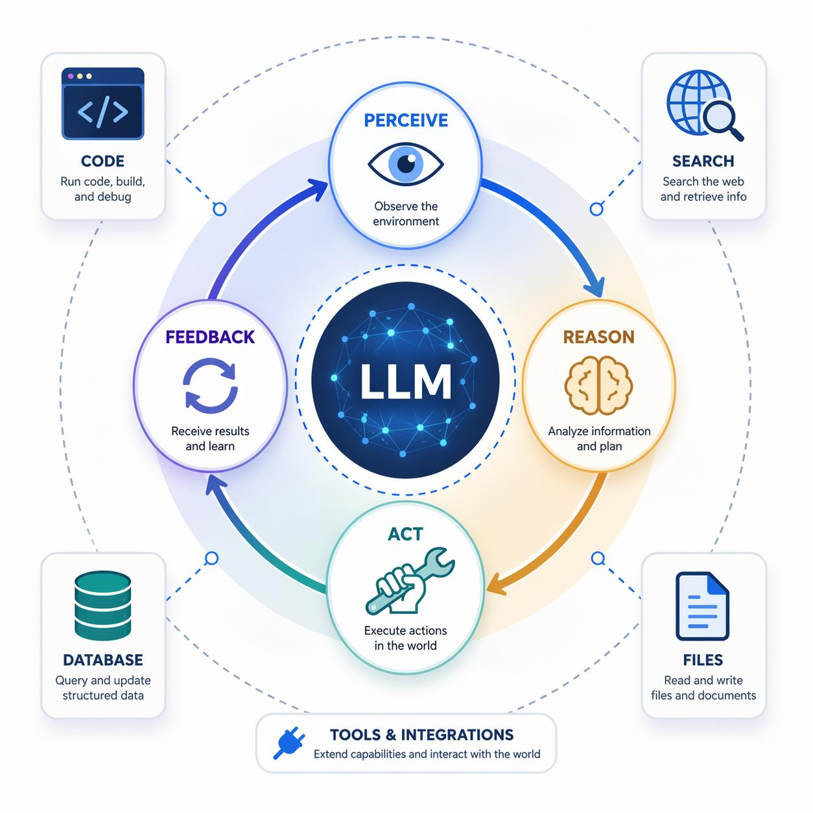

# 第 15 章　AI Agent：驾驭工具的工具

## 一个人的软件公司

2024 年春天，一位名叫本的独立开发者在旧金山的公寓里完成了一个看似不可能的任务：他独自一人，在三个月内构建并发布了一款拥有完整前后端、支付系统、用户管理和自动化客服的 SaaS 产品。换在五年前，这至少需要一个五人团队工作半年。

本的秘密不是他比别人更聪明或更勤奋。他的秘密是：他不再亲自编写大部分代码，不再亲自回复每一封客服邮件，不再亲自调试每一个 bug。他搭建了一组 AI Agent——一个负责前端开发，一个负责后端逻辑，一个负责测试，一个负责客户沟通——然后像一位指挥家那样协调它们的工作。

本不是在使用工具。他在驾驭一群会使用工具的智能体。

这就是 AI Agent 带来的范式转换：如果大语言模型是一个博学但被动的大脑，那么 Agent 就是一个有手有脚、能自主行动的完整个体。

## 核心循环：感知、推理、行动、反馈

什么是 AI Agent？剥去所有技术术语，它的本质是一个循环——一个永不停歇的"感知-推理-行动-反馈"循环。

**感知（Perception）。** Agent 通过各种"感官"接收信息：它可以读取文件、浏览网页、接收用户指令、监听系统日志、观察数据库变化。就像人类通过眼睛和耳朵感知世界，Agent 通过 API 和数据流感知数字世界。

**推理（Reasoning）。** 这是大语言模型发挥核心作用的环节。Agent 将感知到的信息与自己的目标进行比对，分析当前状态与目标状态之间的差距，规划一系列可能的行动步骤，评估每个步骤的风险和收益。这不是简单的"如果-那么"规则匹配，而是真正的推理——Agent 能够处理模糊的目标、不完整的信息和前所未见的情境。

**行动（Action）。** Agent 不只是思考——它行动。它可以调用工具：执行代码、发送邮件、修改文件、查询数据库、调用其他 API。这是 Agent 与纯粹的聊天机器人最本质的区别。聊天机器人给你答案，Agent 给你结果。

**反馈（Feedback）。** 每次行动之后，Agent 观察结果：代码是否通过了测试？邮件是否发送成功？数据是否符合预期？然后它将这些反馈纳入下一轮推理，调整策略，修正错误。这种闭环使 Agent 具备了自我纠错和迭代改进的能力。

这个循环如此简洁，却如此强大。它本质上是人类智能行为的最小模型——观察世界、思考对策、采取行动、从结果中学习——只不过以机器的速度运转。

## Harness 架构：大脑与四肢

在这本书的语境中，"harness"这个词承载着双重含义。作为动词，它是"驾驭"；作为名词，它是"框架"——更具体地说，是将 AI Agent 各个组件连接在一起的软件架构。

这个双关不是修辞游戏，而是深刻的结构类比。

一套马具（harness）的作用是什么？它将马的力量转化为可控的牵引力，同时让驾驭者能够精确地指挥方向和速度。类似地，一个 Agent 框架的作用是：将大语言模型的智能转化为可控的执行力，同时让用户（或开发者）能够精确地指挥目标和边界。

一个典型的 Agent 架构包含以下层次：

**大脑层（LLM Core）。** 大语言模型是 Agent 的认知中枢。它理解指令、分解任务、制定计划、评估选项。如果 Agent 是一匹马，LLM 就是它的神经系统。

**工具层（Tool Layer）。** 这是 Agent 的"四肢"。每一个工具都是一个特定的能力：搜索引擎、代码执行器、文件系统、数据库连接、浏览器、邮件客户端。工具的定义通常包括名称、描述、输入输出格式——本质上是告诉大脑"你有哪些手脚可以使用"。

**记忆层（Memory）。** 短期记忆保存当前对话和任务上下文；长期记忆存储跨会话的知识和偏好。没有记忆，Agent 就像一个失忆的天才——每次醒来都要重新认识世界。

**规划层（Planning）。** 面对复杂任务，Agent 需要将其分解为子任务序列。规划层负责生成执行计划、分配优先级、处理依赖关系。这是从"回答一个问题"到"完成一个项目"的关键跃迁。

**护栏层（Guardrails）。** 这是"缰绳"中最关键的部分——限制 Agent 不能做什么。权限边界、安全审查、成本控制、人类审批节点，这些机制确保 Agent 的自主性被约束在安全范围内。

## 从 Copilot 到 Autopilot：协作的光谱

人与 AI Agent 的协作不是一个非此即彼的选择，而是一条连续的光谱。

**光谱的左端：Copilot 模式。** 人类是飞行员，AI 是副驾驶。人类做每一个决策，AI 提供建议和辅助。程序员写代码时，AI 自动补全下一行；分析师做报告时，AI 帮忙查找数据。人类始终握着操纵杆。

**光谱的中段：协作模式。** 人类设定目标和约束，AI 自主完成执行细节，但在关键节点请求人类确认。"帮我重构这个模块，但每次修改前先让我看一下 diff。"人类从操作者变成了审批者。

**光谱的右端：Autopilot 模式。** 人类只设定最高层目标，AI Agent 自主完成从规划到执行的全过程。"监控这个系统的健康状态，如果出现异常就自动修复，只在修复失败时通知我。"人类从审批者变成了监督者。

今天，大多数 Agent 应用还处于光谱的左半段——Copilot 模式和轻度协作模式。但趋势是清晰的：随着模型能力提升和信任积累，Agent 正在沿着光谱向右移动。这不是因为技术决定论，而是因为经济力量的驱动——每向右移动一步，人类就能从更多的执行性工作中解放出来，去做更高价值的判断和创造。

## 一个人 + 一群 Agent = 一个团队

让我们回到本的故事。他的工作方式代表了一种全新的生产组织形式。

在传统模式下，一个人的产出受限于他自己的时间和技能。如果他是程序员，他不擅长设计；如果他是设计师，他不擅长营销。团队的意义在于互补——不同专长的人组合在一起，覆盖一个项目所需的全部能力。但团队也带来了巨大的协调成本：沟通、会议、等待、误解、冲突。

Agent 改变了这个等式。一个人可以同时驾驭多个具有不同专长的 Agent，获得团队级别的能力覆盖，同时几乎消除了协调成本——因为所有 Agent 都直接从同一个人那里接收指令，不存在人际沟通的损耗。

这不是小幅改进，这是生产函数的结构性变化。一个善于驾驭 Agent 的个体，其产出可以匹敌甚至超越一个小型团队。这对创业者、独立工作者、小型企业意味着什么，我们才刚刚开始理解。

## 驾驭工具的工具

回望人类历史，工具的演化有一条隐秘的主线：从简单工具，到复合工具，到能够操作其他工具的工具。

石器是简单工具——手的延伸。车床是复合工具——它由多个部件协作完成一个功能。而工厂里的自动化控制系统是"操作工具的工具"——它指挥多台机器协同运作。

AI Agent 是这条主线上最新的跃迁。它不只是一个工具，它是一个能够理解目标、选择工具、操作工具、评估结果的元工具。它驾驭搜索引擎、驾驭代码编辑器、驾驭数据库、驾驭浏览器——而人类驾驭它。

这就是"驾驭工具的工具"的含义。人类不再需要逐一操作每个工具，而是驾驭一个能够替自己操作工具的智能体。这如同从骑马跃迁到驾驶马车——你不再直接控制每一步的腿部动作，而是通过缰绳传达意图，让另一个智能体去执行细节。

而这根"缰绳"——Agent 的 harness 架构——就是人类保持控制的关键机制。

## 生产力的加速度

量化 Agent 的生产力提升比量化 LLM 更加复杂，因为 Agent 的价值不在于单个任务的加速，而在于任务链的自动化。

一些早期数据提供了线索：在软件开发领域，使用 Agent 辅助的开发者报告称，端到端的功能交付时间缩短了 30%-70%，具体取决于任务复杂度和 Agent 的自主程度。在客服领域，AI Agent 可以自主处理 60%-80% 的常规工单，将人类客服释放给需要情感智慧和复杂判断的高难度案例。在研究领域，Agent 可以自主完成文献检索、数据清洗、初步分析的全流程，将研究者的时间集中在假设生成和结果解释上。

但最深刻的变化可能不在于"做得更快"，而在于"做到之前做不到的事"。一个人独立开发一款完整产品，一个小团队运营一个以前需要百人的业务——这些不是效率提升，而是可能性边界的扩展。

---

**驾驭时刻：** AI Agent 是人类第一次创造出的"会使用工具的工具"——而驾驭它的方式，恰恰就叫 harness。
