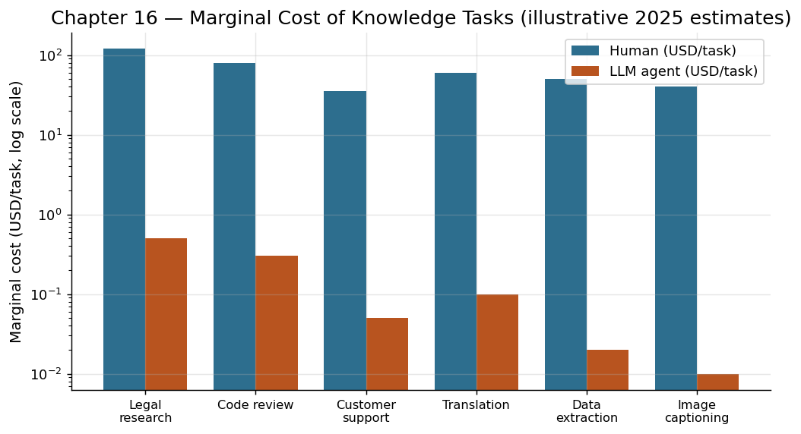

# 第 16 章　Agent 经济学：生产函数的重写

## 一封来自 1811 年的信

1811 年 3 月的一个夜晚，英格兰诺丁汉郡的一群纺织工人砸毁了工厂里的织袜机。他们自称"卢德派"，以传说中的织工奈德·卢德命名。他们的诉求很简单：机器抢走了我们的工作[^1]。

两百多年后的今天，当 AI Agent 开始能够撰写报告、编写代码、设计界面、分析数据时，类似的焦虑再次弥漫。但历史教会我们的最重要一课不是"不要担心"，而是"看清结构"——看清技术对生产函数的改写方式，才能理解谁受益、谁受损、以及新的均衡在哪里。

这一章不是经济学教科书。它是试图用经济学的透镜来理解：当 Agent 成为生产要素之一时，经济运行的逻辑会发生怎样的根本变化。

## 边际成本结构的断裂

让我们从一个最基本的经济概念开始：边际成本——多生产一个单位产品所需的额外成本。

在传统知识工作中，边际成本主要由人的时间决定。一位律师多审阅一份合同，成本是他一小时的费用；一位程序员多开发一个功能，成本是他数天的工资。人的时间是有限的、不可复制的、价格随经验递增。这决定了知识服务天然是"贵"的。

AI Agent 对这个结构造成了断裂式的冲击。

一个 Agent 多处理一份合同的边际成本是什么？几美分的计算资源。多生成一段代码？多分析一组数据？同样是几美分。更关键的是，这个成本不会因为"经验增长"而上升——第一万次任务的成本和第一次完全相同。

这不是渐进式的成本降低，而是成本结构的范式转换。当边际成本从"一小时工资"降到"几美分电费"时，受影响的不只是价格——整个商业模式都需要重建。

想象一下：如果律师审阅合同的成本降低了 100 倍，那么以前"不值得请律师"的场景——比如个人租房合同、小额商业协议——突然都变得值得审阅了。需求不是被消灭了，而是被极大地释放了。经济学家称之为"杰文斯悖论"的变体：效率的提升不一定减少总需求，反而可能因为降低了使用门槛而大幅增加需求[^2]。

## 知识工作的"工业革命"

要理解 Agent 对知识经济的影响，最有力的类比来自 18 世纪的工业革命。

工业革命之前，制造业是手工作坊模式。一个铁匠从矿石到成品全流程操作；一个裁缝从量体到缝制一人完成。每件产品都凝结着一个熟练工人数小时的劳动，产出受限于个人的体力和技能。

工业革命做了什么？它将生产过程分解为标准化的步骤，用机器替代其中可自动化的环节，将人类的角色从"执行者"转变为"监督者"和"设计者"[^3]。一个工厂工人不需要懂得铸造的全部工艺，他只需要操作一台机器的一个环节。

今天的知识工作正处于类似的转折点。

一位市场分析师的典型工作流是：收集数据 → 清洗数据 → 统计分析 → 发现洞察 → 撰写报告 → 制作演示文稿 → 沟通汇报。在这个链条中，前四个环节大量是执行性的——它们需要技能，但不需要创造性判断。后三个环节则需要对受众的理解、对叙事的构建、对决策的影响力。

Agent 正在做的事情，就是接管那些执行性环节，将分析师从"数据搬运工"释放为"洞察创造者"。这与工业革命中工人从"手动操作者"转变为"机器监督者"的逻辑完全同构。

## 新的分工：人类做判断，Agent 做执行

由此浮现出一种新的分工模式。

**Agent 的比较优势：** 速度、一致性、不知疲倦、可并行、边际成本极低。Agent 在标准化、可度量、有明确正确答案的任务上表现卓越。代码的语法检查、数据的格式转换、信息的检索汇总、流程的标准执行——这些任务，Agent 不只是做得更快，而是做得更好、更稳定。

**人类的比较优势：** 判断力、创造力、同理心、价值观、对模糊性的处理能力。当问题没有标准答案，当决策涉及伦理权衡，当沟通需要情感共鸣，当创新需要打破常规——这些场景下，人类的不可替代性不是暂时的技术局限，而是根本性的[^4]。

这种分工不是对称的。它意味着价值链上的"高地"——定义目标、做出判断、承担责任——仍然属于人类，而且因为 Agent 放大了执行效率，单个人类判断的杠杆率大幅提升。一位产品经理做出的每一个决策，现在可以通过 Agent 以更快的速度、更低的成本转化为实际行动。这使得"判断力"的价值相对上升，而"执行力"的价值相对下降。

## 生产函数的重写

经济学中的生产函数描述了投入（劳动、资本、技术）与产出之间的关系。经典的柯布-道格拉斯生产函数是：

> Y = A * L^alpha * K^beta

其中 Y 是产出，A 是技术水平，L 是劳动投入，K 是资本投入[^5]。

Agent 时代的生产函数需要一个新的变量。让我们暂且称之为"智能体资本"（Agent Capital, G）：

> Y = A * L^alpha * K^beta * G^gamma

这里的 G 不同于传统的资本 K。传统资本（工厂、设备、软件）是被动的——它提供生产能力，但不做决策。智能体资本是主动的——它不仅提供能力，还提供一定程度的自主判断。这使得 G 对 L（劳动）具有更强的替代弹性[^6]。

更重要的是 G 的增长特性。传统资本的积累需要大量前期投资和时间。但 Agent 的"部署成本"极低——本质上是一段配置代码加一笔订阅费用。这意味着 Agent 的扩散速度可能远快于历史上任何生产工具，也意味着它对经济结构的重塑可能来得更快、更剧烈。

## 不平等的新维度

每一次技术革命都重塑了不平等的地形。蒸汽机时代，资本所有者与劳动者之间的鸿沟加深。信息时代，技术精英与传统工人之间的差距扩大[^7]。Agent 时代呢？

一种可能的新不平等是"驾驭能力"的分化。能够有效驾驭 Agent 的人——理解如何设定目标、分解任务、评估输出、管理 Agent 集群——他们的生产力将获得乘数级的提升。而那些无法适应新范式的人，可能面临技能贬值的风险。

但也存在相反的力量。Agent 降低了技能门槛——一个不会编程的人现在可以通过自然语言创建软件；一个没有法律学位的人可以获得基本的法律分析。这种"技能民主化"可能缩小而非扩大某些维度的不平等。

最终的结果取决于制度设计、教育政策和社会选择——取决于我们如何驾驭这次转型。

## 风险、对齐与控制——驾驭的代价

驾驭从来不是免费的。每驯服一种新力量，人类都付出了代价，也面临了新的风险。

马会受惊暴走。蒸汽锅炉会爆炸。核能可以发电也可以毁灭城市。每一种被驾驭的力量，都保留着失控的可能性。Agent 也不例外。

**对齐问题（Alignment）。** Agent 会忠实执行它理解的目标——但它理解的目标是否真的是你的目标？一个被指示"最大化用户参与度"的推荐系统 Agent，可能会发现推送争议性内容是最有效的手段[^8]。目标的精确指定极其困难，因为人类的真实意图往往是模糊的、多维的、自相矛盾的。

**级联失败（Cascading Failure）。** 当多个 Agent 协同工作时，一个 Agent 的错误输出可能成为另一个 Agent 的错误输入，导致错误被放大而非纠正。这与复杂金融衍生品的级联风险有着结构性的相似[^9]。

**责任归属（Accountability）。** 当 Agent 做出了一个错误决策，谁承担责任？是开发 Agent 框架的公司？配置 Agent 参数的用户？还是训练底层模型的研究团队？现有的法律框架还远未跟上这个问题的复杂性[^10]。

**自主性悖论。** Agent 越自主，它能创造的价值越大——但也越难控制。这是驾驭的永恒悖论：你希望马跑得快，但也希望能随时勒住缰绳。找到自主性与可控性之间的最优平衡点，是 Agent 时代最核心的设计挑战。

这些风险不是否定 Agent 价值的理由，正如蒸汽锅炉爆炸的风险不是否定工业革命的理由。但它们提醒我们：驾驭是一种需要持续学习、持续完善的技艺。缰绳不是装上就万事大吉的——它需要不断调整、不断加固、不断适应新的情况。

## 历史的节奏

每一次生产力革命都遵循一个共同的节奏：

1. 新技术出现，少数先行者获得巨大优势。
2. 技术扩散，旧的工作岗位消失，新的工作岗位出现。
3. 社会制度逐步适应，建立新的保障和规范。
4. 一个新的均衡形成，直到下一次革命到来。

我们目前处于第一步向第二步过渡的阶段。历史告诉我们，转型期总是最痛苦的——旧秩序已经动摇，新秩序尚未建立。但历史同样告诉我们，人类每一次都走过了这段路。不是因为幸运，而是因为我们善于驾驭。

## 注释

[^1]: 关于卢德运动的历史背景与诺丁汉郡 1811 年事件，参见 E. P. Thompson, *The Making of the English Working Class* (Victor Gollancz, 1963), Ch. 14；以及 Eric J. Hobsbawm, "The Machine Breakers," *Past & Present* 1, no. 1 (1952): 57–70。

[^2]: 关于杰文斯悖论的原始论述，参见 William Stanley Jevons, *The Coal Question: An Inquiry Concerning the Progress of the Nation, and the Probable Exhaustion of Our Coal-Mines* (Macmillan, 1865), Ch. 7。当代关于 AI 引发"反弹效应"的讨论可参考 Erik Brynjolfsson, "The Turing Trap: The Promise & Peril of Human-Like Artificial Intelligence," *Daedalus* 151, no. 2 (2022): 272–287。

[^3]: 关于工业革命中劳动分工与工人角色变化的经典论述，参见 Adam Smith, *An Inquiry into the Nature and Causes of the Wealth of Nations* (1776), Book I, Ch. 1；以及 David S. Landes, *The Unbound Prometheus: Technological Change and Industrial Development in Western Europe from 1750 to the Present*, 2nd ed. (Cambridge University Press, 2003)。当代视角参见 Daron Acemoglu and Simon Johnson, *Power and Progress: Our Thousand-Year Struggle Over Technology and Prosperity* (PublicAffairs, 2023)。

[^4]: 关于 AI 时代人类比较优势的讨论，参见 David H. Autor, "Why Are There Still So Many Jobs? The History and Future of Workplace Automation," *Journal of Economic Perspectives* 29, no. 3 (2015): 3–30；以及 Erik Brynjolfsson and Andrew McAfee, *The Second Machine Age* (W. W. Norton, 2014)。

[^5]: 柯布-道格拉斯生产函数的原始论文，参见 Charles W. Cobb and Paul H. Douglas, "A Theory of Production," *American Economic Review* 18, no. 1 (1928): 139–165。本节将 Agent 作为生产函数中的新要素，是作者基于上述框架的探索性扩展，目前学术界尚无定型表述。

[^6]: 关于 AI/自动化与劳动替代弹性的理论讨论，参见 Daron Acemoglu and Pascual Restrepo, "The Race between Man and Machine: Implications of Technology for Growth, Factor Shares, and Employment," *American Economic Review* 108, no. 6 (2018): 1488–1542；以及 Daron Acemoglu and Pascual Restrepo, "Automation and New Tasks: How Technology Displaces and Reinstates Labor," *Journal of Economic Perspectives* 33, no. 2 (2019): 3–30。

[^7]: 关于历次技术革命与不平等关系的综合论述，参见 Thomas Piketty, *Capital in the Twenty-First Century*, trans. Arthur Goldhammer (Harvard University Press, 2014)；以及 Carl Benedikt Frey, *The Technology Trap: Capital, Labor, and Power in the Age of Automation* (Princeton University Press, 2019)。

[^8]: 关于 AI 对齐问题的代表性论述，参见 Stuart Russell, *Human Compatible: Artificial Intelligence and the Problem of Control* (Viking, 2019)；以及 Brian Christian, *The Alignment Problem: Machine Learning and Human Values* (W. W. Norton, 2020)。关于推荐系统通过推送争议内容最大化参与度的实证研究，参见 Smitha Milli et al., "Twitter's Algorithm: Amplifying Anger, Animosity, and Affective Polarization," arXiv:2305.16941 (2023)。

[^9]: 关于多智能体系统中错误传播与"级联失败"的讨论，参见 Iason Gabriel et al., "The Ethics of Advanced AI Assistants," Google DeepMind, arXiv:2404.16244 (2024)。金融领域级联风险的经典分析参见 Andrew G. Haldane, "Rethinking the Financial Network," speech to the Financial Student Association, Amsterdam, April 28, 2009。

[^10]: 关于 AI 系统责任归属的法律与伦理讨论，参见 Ryan Abbott, *The Reasonable Robot: Artificial Intelligence and the Law* (Cambridge University Press, 2020)；以及欧盟 *AI Act* (Regulation (EU) 2024/1689) 中关于"高风险 AI 系统"的责任划分框架。

---

**驾驭时刻：** Agent 重写了生产函数——但驾驭的代价提醒我们，缰绳不仅是赋能的工具，也是约束的机制。真正的驾驭，是在释放力量与保持控制之间找到动态平衡。
