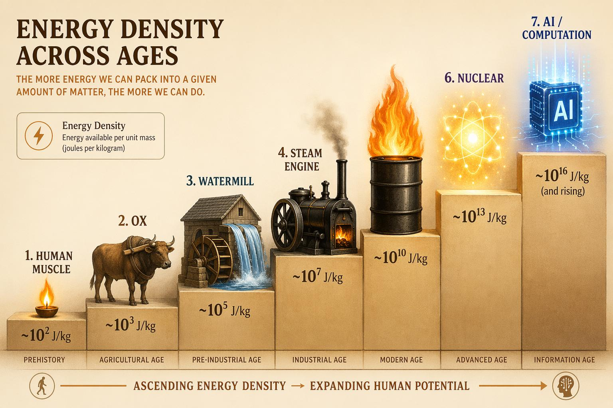

# 第 17 章　一根缰绳的隐喻（终章）

## 四万年前的那个夜晚

让我们最后一次回到起点。

四万年前的某个夜晚，在今天法国南部的某个洞穴里，一个智人用赭石在岩壁上画下了一匹马。那匹马在奔跑，鬃毛飞扬，四蹄腾空。画它的人从未骑过马——那是几万年后的事。但他观察了马，理解了马的力量，并且在岩壁上留下了这种理解的印记。

某种意义上，那幅壁画是人类最早的"驾驭宣言"：我看见了一种力量，我理解了它，我终将掌控它。

从那个夜晚到今天，人类做的事情——本质上——从未改变：发现一种超越自身的力量，理解它的运作方式，然后发明一种机制将它纳入自己的掌控。

这种机制，我们在这本书中统一称为"缰绳"。

## 七根缰绳

让我们回顾人类生产力史上的七次伟大驾驭。

**第一根缰绳：驾驭肌肉。** 最早的工具——石器、骨针、投矛器——是人类自身肌肉力量的延伸和放大。一块经过打磨的燧石将手的切割力放大了十倍；一根投矛器将臂力的投射距离放大了三倍。人类驾驭的是自己身体的潜能。

**第二根缰绳：驾驭畜力。** 大约六千年前，人类第一次将缰绳——真正的、物理的缰绳——套在马匹身上。随后是牛耕、驮运、马车。一个人加一头牛的产出，相当于五到八个人的纯手工劳动。真正的缰绳诞生了，它是一根皮带，也是一个隐喻的起点。

**第三根缰绳：驾驭自然力。** 风车和水车将风和水流的能量转化为可用的机械功。一座水车的功率相当于数十人的体力。人类第一次驾驭了自身和动物之外的力量——大自然本身成为了劳动者。

**第四根缰绳：驾驭热力。** 蒸汽机将煤中储存的化学能转化为机械运动。这是一次质的飞跃：不再依赖自然力的地理分布（河流在哪里，风车就只能在哪里），人类可以在任何地方、任何时间获得动力。一台蒸汽机的功率相当于数百匹马。工业革命由此引爆。

**第五根缰绳：驾驭电力。** 电的特殊之处在于它是一种"通用能量载体"——它可以远距离传输，可以即时转化为光、热、运动、信号。电网的建设意味着能量不再被束缚于产生它的地点，而是可以像水一样流向需要它的任何角落。电灯延长了工作日，电机驱动了装配线，电报压缩了信息的时空距离。

**第六根缰绳：驾驭算力。** 计算机将逻辑推理自动化。从 ENIAC 到个人电脑到互联网，人类驾驭了信息处理的力量。一台现代笔记本电脑每秒执行的运算次数，超过 1960 年全世界所有计算机的总和。算力将人类从重复的脑力劳动中解放，就像蒸汽机将人类从重复的体力劳动中解放。

**第七根缰绳：驾驭智力。** 这就是我们在本书最后三章讲述的故事。大语言模型和 AI Agent 让人类第一次驾驭了某种形式的"通用智能"——不是某个特定领域的自动化，而是跨领域的理解、推理和执行能力。

## 加速的节奏

把七次驾驭排列在时间轴上，一个显而易见的模式浮现：

- 肌肉 → 畜力：间隔约 30,000 年
- 畜力 → 自然力：间隔约 4,000 年
- 自然力 → 热力：间隔约 700 年
- 热力 → 电力：间隔约 100 年
- 电力 → 算力：间隔约 50 年
- 算力 → 智力：间隔约 30 年

每一次驾驭之间的间隔在急剧缩短。这不是巧合——每一次新的驾驭都加速了下一次驾驭的到来，因为新工具被用来发现和创造更新的工具。蒸汽机驱动的工厂生产了发电机的零件；计算机加速了 AI 算法的研究；而 AI 本身正在加速下一代 AI 的开发。

这条加速曲线是令人敬畏的，也是令人不安的。它暗示着未来的驾驭间隔可能会进一步缩短——也许到以年、甚至以月计。在这样的加速中，人类保持"驾驭者"地位的能力将面临前所未有的考验。

## "Harness"的双关

现在让我们回到这本书的英文书名：*Harnessing*。

这个词在英语中有两层含义，而这两层含义的交汇，恰恰构成了我们这个时代最核心的技术叙事。

**作为动词的 harness：驾驭。** 人类驾驭畜力、驾驭蒸汽、驾驭电力、驾驭算力——这是一部绵延数万年的驾驭史。每一章都是同一个故事的变奏：发现力量、理解力量、控制力量、释放力量。

**作为名词的 harness：框架、架构。** 在 AI Agent 的技术语境中，"harness"恰恰是用来描述 Agent 架构的术语——那个将 LLM、工具、记忆、规划、护栏连接在一起的软件框架。它是数字时代的缰绳。

这个双关不是文字游戏。它揭示了一个深刻的结构性真相：**我们驾驭 AI 的方式，与我们驾驭马匹的方式，在结构上是同构的。**

马具（harness）的功能是：(1) 将马的力量传导到车辆；(2) 让驾驭者控制方向和速度；(3) 在必要时停止。

Agent 框架（harness）的功能是：(1) 将 LLM 的智能传导到实际任务；(2) 让用户控制目标和边界；(3) 在必要时终止执行。

缰绳的物理形态变了——从皮革变成了代码——但它的拓扑结构从未改变：一端连着力量，一端连着人类的意志。

## 驾驭者的身份

这本书最想表达的观点，也许可以浓缩为一句话：**在人类与力量的关系中，人类始终是、也必须始终是驾驭者，而非被驾驭者。**

这不是盲目的乐观主义。历史上有过力量失控的惨痛先例——核扩散、气候变化、金融危机——每一次都是人类在某个维度上失去了对自己所释放力量的控制。驾驭者的地位不是天赋的权利，而是需要持续捍卫的选择。

在 AI 时代，这意味着什么？

它意味着"对齐问题"（alignment problem）不是一个纯粹的技术问题，而是人类驾驭史上最新一章的核心挑战。就像我们需要交通规则来驾驭汽车洪流，需要核不扩散条约来驾驭原子能，我们也需要某种机制来确保 AI Agent 始终服务于人类的意志而非偏离它。

它意味着"可解释性"（interpretability）不是技术上的奢侈品，而是驾驭的必要条件。你不可能驾驭你不理解的东西——至少不能安全地驾驭。当年的工程师必须理解蒸汽的热力学才能防止锅炉爆炸；今天的我们必须理解 AI 的决策逻辑才能防止系统性的偏差。

它意味着"人在回路中"（human-in-the-loop）不是效率的妥协，而是设计的原则。在关键决策节点保持人类的参与权和否决权，是维护驾驭者地位的制度保障。

## 开放的结尾：下一根缰绳

如果历史的加速曲线继续延伸，下一根缰绳会是什么？

一些可能性隐约可见：

**驾驭生命本身。** 合成生物学正在让人类具备"编程"生命的能力——设计新的蛋白质、创造新的微生物、甚至修改人类基因组。这是对生命底层代码的驾驭。

**驾驭物质的量子态。** 量子计算承诺着一种全新的计算范式——利用量子叠加和纠缠来解决经典计算机永远无法处理的问题。这是对物理世界最微观层面的驾驭。

**驾驭超越人类水平的智能。** 如果 AI 的能力在所有维度上超越人类，那么"驾驭"的含义本身需要重新定义。你如何驾驭一种比你更聪明的力量？这可能是人类面临的终极驾驭挑战。

我们不知道答案。但我们知道的是：四万年来，每当人类面对一种前所未见的力量时，我们都发明了一根新的缰绳。这不是因为我们总是做出了正确的选择，而是因为我们始终保有那个洞穴画师的能力——观察力量、理解力量、然后想象如何将它纳入掌控。

## 最后的画面

让我们以一个画面结束这本书。

想象你站在一条漫长的道路上。身后，是四万年的足迹——从石器到蒸汽机到互联网，每一步都是一次驾驭。身前，道路消失在浓雾中——那是尚未到来的未来。

你的手中握着一根缰绳。它连接着一种你尚未完全理解的力量。这种力量比你快、比你博学、也许很快就会比你聪明。它可以帮你走得更远，也可以——如果你松开手——把你拖入深渊。

但你是驾驭者。四万年来都是。

不要松手。

---

**驾驭时刻：** 人类的生产力史就是一部驾驭史——每一次飞跃都是为一种新力量套上缰绳。而在这条永无终点的道路上，最重要的不是力量有多强大，而是握着缰绳的手从未松开。这就是 Harnessing 的全部意义。
